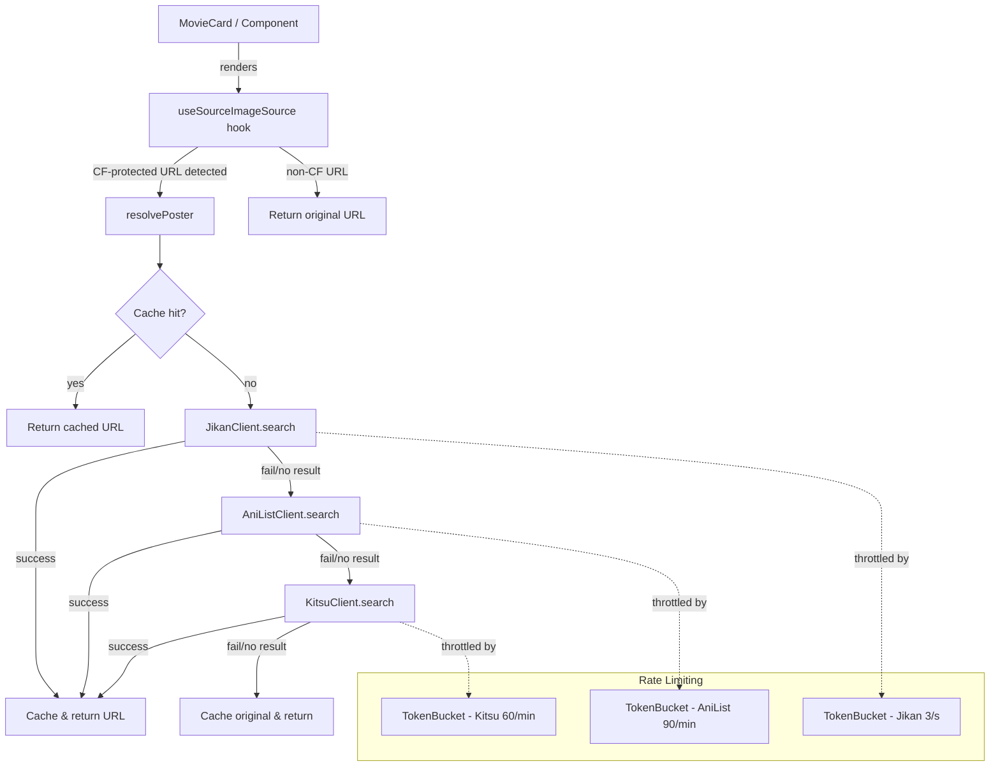

# Design Document: Anime Poster Module

## Overview

The Anime Poster Module resolves alternative poster URLs for anime content whose original posters are hosted on Cloudflare-protected CDNs (e.g., `cdn.animevietsub.site`). When the native `expo-image` component cannot load a poster due to CF session challenges, this module searches public anime database APIs by title and returns an unprotected poster URL.

The module integrates into the existing `useSourceImageSource` hook, activating lazily at render time. It follows a waterfall strategy: Jikan → AniList → Kitsu, with in-memory caching and per-API rate limiting.

### Design Decisions

1. **Lazy resolution over pre-fetching**: Posters resolve only when a component renders, conserving bandwidth on mobile devices.
2. **Waterfall fallback over parallel requests**: Sequential API calls reduce total request volume and respect rate limits. Jikan is prioritized because it requires no authentication and has simple REST semantics.
3. **In-memory cache over persistent storage**: Session-scoped cache avoids stale URLs and keeps the implementation simple. Poster URLs from these APIs are stable enough that re-resolving on app restart is acceptable.
4. **Token bucket rate limiting**: Provides smooth request distribution rather than bursty behavior at window boundaries.

## Architecture



### Module Boundaries

| Layer | Responsibility |
|-------|---------------|
| `hooks/useSourceImageSource.ts` | Entry point; detects CF URLs, triggers async resolution, manages React state |
| `modules/poster/resolvePoster.ts` | Orchestrates cache lookup, waterfall API calls, timeout |
| `modules/poster/clients/` | API-specific clients (Jikan, AniList, Kitsu) |
| `modules/poster/cache.ts` | In-memory Map-based cache |
| `modules/poster/rateLimiter.ts` | Token bucket rate limiter |
| `modules/poster/titleNormalizer.ts` | Title normalization (diacritics, lowercase, trim) |
| `modules/poster/config.ts` | Configuration (blocked hostnames, source IDs, timeouts) |

## Components and Interfaces

### Public API

```typescript
// modules/poster/index.ts
export interface PosterModuleConfig {
  /** CDN hostnames that are CF-protected */
  blockedHostnames: string[];
  /** Source IDs that require poster fallback */
  blockedSourceIds: string[];
  /** Overall timeout for resolution in ms (default: 3000) */
  timeoutMs: number;
}

export interface ResolvePosterParams {
  url: string;
  title: string;
  sourceId?: string;
}

/**
 * Resolves an alternative poster URL if the original is CF-protected.
 * Returns the original URL if not blocked or if all APIs fail.
 */
export function resolvePoster(params: ResolvePosterParams): Promise<string>;

/**
 * Updates the module configuration at runtime.
 */
export function configurePosterModule(config: Partial<PosterModuleConfig>): void;

/**
 * Checks if a URL is CF-protected based on current config.
 */
export function isCfProtected(url: string, sourceId?: string): boolean;
```

### API Client Interface

```typescript
// modules/poster/clients/types.ts
export interface PosterSearchResult {
  posterUrl: string;
  title: string;
  score?: number;
}

export interface PosterApiClient {
  name: string;
  search(query: string): Promise<PosterSearchResult | null>;
}
```

### Rate Limiter Interface

```typescript
// modules/poster/rateLimiter.ts
export interface TokenBucketConfig {
  maxTokens: number;
  refillRate: number;       // tokens per second
  backoffMs: number;        // pause duration on 429
}

export class TokenBucket {
  constructor(config: TokenBucketConfig);
  /** Waits until a token is available, then consumes it */
  acquire(): Promise<void>;
  /** Triggers backoff (called on HTTP 429) */
  backoff(): void;
}
```

### Title Normalizer

```typescript
// modules/poster/titleNormalizer.ts
/**
 * Normalizes an anime title for cache keys and API queries:
 * - Removes diacritics (NFD + strip combining marks)
 * - Converts to lowercase
 * - Trims whitespace
 * - Collapses multiple spaces to single space
 */
export function normalizeTitle(title: string): string;
```

### Hook Integration

```typescript
// hooks/useSourceImageSource.ts (modified)
export function useSourceImageSource(
  uri?: string,
  sourceId?: string,
  title?: string,
  year?: string | number
): ImageSourceValue | undefined;
```

The hook will:
1. Check if the URI is CF-protected via `isCfProtected(uri, sourceId)`
2. If yes, use `useState` + `useEffect` to call `resolvePoster` asynchronously
3. Return the resolved URL once available, or the original URL as initial/fallback value

## Data Models

### Cache Entry

```typescript
interface CacheEntry {
  resolvedUrl: string;    // The resolved poster URL (or original if all APIs failed)
  isNegative: boolean;    // True if this is a negative cache entry (all APIs failed)
  timestamp: number;      // Date.now() when cached
}
```

### Poster Cache (Map-based)

```typescript
// Key: normalized title string
// Value: CacheEntry
const cache = new Map<string, CacheEntry>();
```

### API Response Shapes

**Jikan v4** (`GET https://api.jikan.moe/v4/anime?q={query}&limit=1`):
```typescript
interface JikanResponse {
  data: Array<{
    mal_id: number;
    title: string;
    images: {
      jpg: { large_image_url: string };
      webp: { large_image_url: string };
    };
  }>;
}
```

**AniList** (`POST https://graphql.anilist.co`):
```typescript
// GraphQL query:
// query ($search: String) {
//   Page(perPage: 5) {
//     media(search: $search, type: ANIME) {
//       title { romaji english native }
//       coverImage { large extraLarge }
//     }
//   }
// }

interface AniListResponse {
  data: {
    Page: {
      media: Array<{
        title: { romaji: string; english: string | null; native: string | null };
        coverImage: { large: string; extraLarge: string };
      }>;
    };
  };
}
```

**Kitsu** (`GET https://kitsu.io/api/edge/anime?filter[text]={query}&page[limit]=1`):
```typescript
interface KitsuResponse {
  data: Array<{
    id: string;
    attributes: {
      canonicalTitle: string;
      posterImage: {
        small: string;
        medium: string;
        large: string;
        original: string;
      };
    };
  }>;
}
```

### Default Configuration

```typescript
const DEFAULT_CONFIG: PosterModuleConfig = {
  blockedHostnames: ["cdn.animevietsub.site"],
  blockedSourceIds: ["animevietsub"],
  timeoutMs: 3000,
};
```


## Correctness Properties

*A property is a characteristic or behavior that should hold true across all valid executions of a system—essentially, a formal statement about what the system should do. Properties serve as the bridge between human-readable specifications and machine-verifiable correctness guarantees.*

### Property 1: Waterfall Resolution Order

*For any* CF-protected URL and anime title, given any combination of API success/failure states across Jikan, AniList, and Kitsu, the module SHALL return the poster URL from the first successful API in the order Jikan → AniList → Kitsu, or the original URL unchanged if all three fail.

**Validates: Requirements 1.4, 1.5, 1.6, 1.7**

### Property 2: CF-Protected URL Detection

*For any* URL and configurable blocked hostname list, `isCfProtected` SHALL return `true` if and only if the URL's hostname appears in the blocked list or the source ID appears in the blocked source IDs list. URLs not matching either condition SHALL pass through without any API call.

**Validates: Requirements 2.1, 2.2, 7.2**

### Property 3: Title Normalization Invariants

*For any* input string, the `normalizeTitle` function SHALL produce an output that is: (a) entirely lowercase, (b) free of Unicode combining marks (diacritics), (c) trimmed of leading/trailing whitespace, and (d) contains no consecutive whitespace characters.

**Validates: Requirements 3.1**

### Property 4: AniList Best-Match Selection

*For any* non-empty AniList search result set and normalized query title, the module SHALL select the result whose title (romaji, english, or native) has the highest string similarity to the normalized query.

**Validates: Requirements 3.3**

### Property 5: Cache Stores All Resolution Results

*For any* resolution attempt (successful or failed), the Poster_Cache SHALL contain an entry keyed by the normalized title after resolution completes. Successful resolutions store the resolved URL; total failures store the original URL as a negative cache entry.

**Validates: Requirements 4.1, 4.4**

### Property 6: Cache Hit Bypasses API Calls

*For any* normalized title that already exists in the Poster_Cache, calling `resolvePoster` with that title SHALL return the cached URL without invoking any API client.

**Validates: Requirements 4.2**

### Property 7: Token Bucket Rate Enforcement

*For any* token bucket configured with `maxTokens` capacity and `refillRate` tokens/second, no more than `maxTokens` calls SHALL be permitted within any `maxTokens / refillRate` second window, regardless of request arrival pattern.

**Validates: Requirements 5.1, 5.2**

### Property 8: Timeout Returns Original URL

*For any* resolution attempt that exceeds the configured `timeoutMs` duration, the module SHALL resolve with the original URL unchanged, regardless of pending API responses.

**Validates: Requirements 6.3**

## Error Handling

### Network Errors

| Scenario | Behavior |
|----------|----------|
| API returns HTTP 4xx (non-429) | Treat as "no result", proceed to next API in waterfall |
| API returns HTTP 429 | Trigger 5-second backoff on that API's rate limiter, proceed to next API |
| API returns HTTP 5xx | Treat as "no result", proceed to next API |
| Network timeout (per-request) | Abort after 2.5s per individual API call, proceed to next |
| DNS resolution failure | Treat as network error, proceed to next API |
| Invalid JSON response | Treat as "no result", proceed to next API |

### Overall Timeout

The `resolvePoster` function wraps the entire waterfall in a `Promise.race` against a timeout timer (default 3000ms). If the timeout fires first, the original URL is returned and any in-flight requests are abandoned (not cancelled, just ignored).

### Error Propagation

- The module NEVER throws to the caller. All errors are caught internally.
- Failed resolutions return the original URL (graceful degradation).
- Errors are logged via `console.warn` for debugging but do not surface to the UI.

### Rate Limiter Recovery

- On HTTP 429: the specific API's token bucket enters a 5-second backoff state.
- During backoff, `acquire()` resolves only after the backoff period expires.
- After backoff, normal token refill resumes.

### Cache Consistency

- Cache writes are synchronous (Map.set) and happen before the Promise resolves.
- No race condition between concurrent requests for the same title: the first to resolve writes the cache, subsequent requests will hit the cache.
- Deduplication: if multiple components request the same title simultaneously, a pending-request map ensures only one API call chain executes per title.

## Testing Strategy

### Property-Based Testing

**Library**: [fast-check](https://github.com/dubzzz/fast-check) (TypeScript-native, works with any test runner)

**Test Runner**: [Vitest](https://vitest.dev/) (fast, TypeScript-first, compatible with Expo projects)

**Configuration**: Each property test runs a minimum of 100 iterations.

**Tag format**: Each test is tagged with a comment: `// Feature: anime-poster-module, Property {N}: {title}`

Property tests will cover:
- **Property 1**: Generate random API response combinations (success/failure for each of 3 APIs), verify waterfall order
- **Property 2**: Generate random URLs with random hostnames, random blocked lists, verify detection correctness
- **Property 3**: Generate random Unicode strings, verify normalization invariants hold
- **Property 4**: Generate random AniList result sets with varying titles, verify best-match selection
- **Property 5**: Generate random resolution scenarios, verify cache state after each
- **Property 6**: Pre-populate cache, generate random lookups, verify no API calls on hits
- **Property 7**: Generate random request arrival times, verify token consumption stays within limits
- **Property 8**: Generate random slow responses exceeding timeout, verify original URL returned

### Unit Tests (Example-Based)

- Default configuration includes `cdn.animevietsub.site` and `animevietsub` source ID
- Hook returns `undefined` when URI is undefined
- Hook returns original URL synchronously for non-CF URLs
- Jikan client correctly parses a known response shape
- AniList client correctly parses a known GraphQL response
- Kitsu client correctly parses a known JSON:API response
- Backoff triggers on 429 and pauses for 5 seconds
- Deduplication prevents concurrent API calls for the same title

### Integration Tests

- End-to-end resolution with mocked HTTP (MSW or similar) for all three APIs
- Verify the hook updates React state after async resolution completes
- Verify timeout behavior with artificially delayed responses

### Test Dependencies to Install

```json
{
  "devDependencies": {
    "vitest": "^3.2.0",
    "fast-check": "^4.0.0",
    "@testing-library/react-native": "^12.0.0"
  }
}
```
