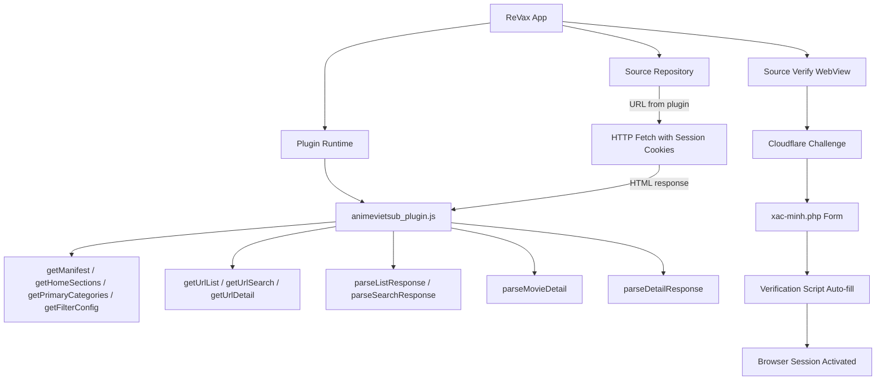

# Design Document: AnimeVietSub Plugin

## Overview

This design describes the implementation of a ReVax plugin for animevietsub.site — a Vietnamese anime streaming site protected by Cloudflare and a custom knowledge-questions verification form. The plugin follows the established vanilla JS plugin contract (ES5, no imports, regex-based HTML parsing) and integrates with the app's browser session and Cloudflare bypass systems.

The plugin consists of two deliverables:
1. **`animevietsub_plugin.js`** — The main plugin file implementing all required functions
2. **Verification script injection** — A code addition to `app/source-verify.tsx` that auto-fills the xac-minh.php knowledge questions form after Cloudflare is passed

### Key Design Decisions

- **ES5-only JavaScript**: The plugin runtime uses `new Function(script)` in a sandboxed context without DOM APIs. All parsing uses regex and string manipulation.
- **Two-step verification**: Cloudflare is handled by existing app infrastructure; the knowledge questions form is handled by injecting a script into the WebView that detects and auto-fills the form.
- **PLAYER_DATA extraction**: Video streams are resolved by parsing the inline `window.PLAYER_DATA` JSON from watch page HTML, supporting both iframe embeds and direct m3u8/mp4 URLs.
- **CDN image URLs**: Poster images use `cdn.animevietsub.site` which doesn't require authentication cookies.

## Architecture



### Data Flow

1. **Home/Browse**: App calls `getHomeSections()` → gets section slugs → calls `getUrlList(slug, filters)` → fetches HTML → calls `parseListResponse(html)` → displays movie cards
2. **Search**: App calls `getUrlSearch(keyword, filters)` → fetches HTML → calls `parseSearchResponse(html)` → displays results
3. **Detail**: User taps movie → app calls `getUrlDetail(movieSlug)` → fetches HTML → calls `parseMovieDetail(html)` → displays detail with episode list
4. **Watch**: User taps episode → app calls `getUrlDetail(episodeSlug)` → fetches watch page HTML → calls `parseDetailResponse(html)` → extracts stream URL → plays video

## Components and Interfaces

### 1. Plugin File (`repo/plugins/animevietsub_plugin.js`)

A single vanilla JS file with these top-level function declarations:

| Function | Signature | Returns |
|----------|-----------|---------|
| `getManifest` | `()` | JSON string (manifest object) |
| `getHomeSections` | `()` | JSON string (section array) |
| `getPrimaryCategories` | `()` | JSON string (category array) |
| `getFilterConfig` | `()` | JSON string (filter config object) |
| `getUrlList` | `(slug, filtersJson)` | Plain URL string |
| `getUrlSearch` | `(keyword, filtersJson)` | Plain URL string |
| `getUrlDetail` | `(slug)` | Plain URL string |
| `parseListResponse` | `(html)` | JSON string (`{items, pagination}`) |
| `parseSearchResponse` | `(html)` | JSON string (`{items, pagination}`) |
| `parseMovieDetail` | `(html)` | JSON string (movie detail) or `"null"` |
| `parseDetailResponse` | `(html)` | JSON string (stream result) or `"{}"` |

### 2. Verification Script Integration (`app/source-verify.tsx`)

The existing `buildVerificationScript` function is modified to include animevietsub-specific logic that:
- Detects when the WebView is on a URL containing `xac-minh.php`
- Locates the `#verify-form` element
- Auto-fills the five input fields with fixed answers
- Clicks the `#btn-submit` button
- Falls back to standard behavior on timeout or missing elements

### 3. Plugin Registry Entry (`repo/plugins.json`)

A new entry added to the plugins array with id `"animevietsub"`, pointing to the hosted script URL.

### Utility Functions (Internal to Plugin)

```javascript
// HTML entity decoder (regex-based, no DOM)
var PluginUtils = {
    cleanText: function(text) { /* strips tags, decodes entities, trims */ },
    decodeEntities: function(str) { /* &amp; &lt; &gt; &quot; &#39; &#NNN; */ }
};
```

## Data Models

### Manifest Object
```javascript
{
    "id": "animevietsub",
    "name": "AnimeVietSub",
    "version": "1.0.0",
    "baseUrl": "https://animevietsub.site",
    "iconUrl": "https://cdn.animevietsub.site/data/logo/logoz.png",
    "isEnabled": true,
    "isAdult": false,
    "type": "MOVIE",
    "layoutType": "VERTICAL"
}
```

### Home Section Object
```javascript
{ slug: "danh-sach/list-dang-chieu", title: "Anime Đang Chiếu", type: "Horizontal", path: "" }
```

### Parsed Movie Item (from listing/search)
```javascript
{
    id: "tensei-shitara-slime-datta-ken-4th-season-a5445",  // slug from href
    title: "Lúc Đó, Tôi Đã Chuyển Sinh Thành Slime Mùa 4",
    posterUrl: "https://cdn.animevietsub.site/data/poster/animevsub-zXsu3LFTlB.jpg",
    episode_current: "TẬP 06"
}
```

### Parsed Movie Detail
```javascript
{
    id: "kami-no-shizuku-a5976",
    title: "Kami no Shizuku",
    posterUrl: "https://cdn.animevietsub.site/data/poster/animevsub-4yF35kFDNg.jpg",
    backdropUrl: "https://cdn.animevietsub.site/data/banner/animevsub-WirID2Bv9k.jpeg",
    description: "Shizuku Kanzaki, con trai của một chuyên gia...",
    year: 2026,
    rating: 7.6,
    category: "Seinen, Drama, Mystery",
    status: "Phim đang chiếu/Cập Nhật Tập 06 VietSub",
    servers: [
        {
            name: "VietSub #1",
            episodes: [
                { id: "phim/kami-no-shizuku-a5976/tap-01-112814.html", name: "Tập 01", slug: "phim/kami-no-shizuku-a5976/tap-01-112814.html" },
                { id: "phim/kami-no-shizuku-a5976/tap-02-112958.html", name: "Tập 02", slug: "phim/kami-no-shizuku-a5976/tap-02-112958.html" }
            ]
        }
    ]
}
```

### Stream Result (from watch page)
```javascript
{
    url: "https://storage.googleapiscdn.com/player/09eb05f1cf65fa46...",
    isEmbed: true,
    headers: {
        "Referer": "https://animevietsub.site/",
        "User-Agent": "Mozilla/5.0 (Windows NT 10.0; Win64; x64) AppleWebKit/537.36 (KHTML, like Gecko) Chrome/120.0.0.0 Safari/537.36"
    }
}
```

### URL Patterns

| Context | Pattern | Example |
|---------|---------|---------|
| Listing (section) | `https://animevietsub.site/{slug}/trang-{page}.html` | `https://animevietsub.site/anime-bo/trang-2.html` |
| Listing (genre) | `https://animevietsub.site/the-loai/{genre}/trang-{page}.html` | `https://animevietsub.site/the-loai/hanh-dong/trang-1.html` |
| Search | `https://animevietsub.site/tim-kiem/{keyword}/trang-{page}.html` | `https://animevietsub.site/tim-kiem/one+piece/trang-1.html` |
| Detail (movie) | `https://animevietsub.site/phim/{slug}/` | `https://animevietsub.site/phim/kami-no-shizuku-a5976/` |
| Watch (episode) | `https://animevietsub.site/phim/{slug}/tap-{num}-{epId}.html` | `https://animevietsub.site/phim/kami-no-shizuku-a5976/tap-01-112814.html` |

### PLAYER_DATA Structure (from watch page)
```javascript
window.PLAYER_DATA = {
    "_fxStatus": 1,
    "success": 1,
    "title": "AnimeVsub",
    "link": "https://storage.googleapiscdn.com/player/...",
    "playTech": "iframe",  // "iframe" | "api" | "all"
    "img": "https://cdn.animevietsub.site/data/banner/...",
    "episode_id": "112814"
};
```

## Correctness Properties

*A property is a characteristic or behavior that should hold true across all valid executions of a system — essentially, a formal statement about what the system should do. Properties serve as the bridge between human-readable specifications and machine-verifiable correctness guarantees.*

### Property 1: URL list generation produces valid structured URLs

*For any* slug string (including empty), any category filter string, any sort filter value, any year filter value, and any positive integer page number, `getUrlList(slug, JSON.stringify(filters))` SHALL return a string that starts with "https://animevietsub.site/", incorporates the slug or category in the path, and contains the page number as "trang-{page}" in the URL. When filtersJson is null or undefined, it SHALL default page to 1 without throwing.

**Validates: Requirements 6.1, 6.2, 6.3, 6.4, 6.5, 6.6**

### Property 2: Search URL generation encodes keywords and includes filters

*For any* keyword string (including empty and whitespace-only) and any filters object with page number and optional sort value, `getUrlSearch(keyword, JSON.stringify(filters))` SHALL return a plain (non-JSON-encoded) URL in the format `https://animevietsub.site/tim-kiem/{encoded_keyword}/trang-{page}.html` where spaces are replaced by "+" and the sort value (if present and valid) is appended as `?sort={value}`.

**Validates: Requirements 7.1, 7.2, 7.3, 7.4**

### Property 3: getUrlDetail correctly handles any slug type

*For any* slug string, `getUrlDetail(slug)` SHALL: return the slug unchanged if it starts with "http://" or "https://"; otherwise return "https://animevietsub.site/" concatenated with the slug. The result SHALL always be a plain string (not JSON-encoded).

**Validates: Requirements 8.1, 8.2, 8.3, 8.4**

### Property 4: Listing parse extracts exactly the valid items

*For any* HTML string containing N `<div class="TPostMv">` elements where each has an anchor with href containing "/phim/" and a non-empty `.Title` text, `parseListResponse(html)` SHALL return a JSON string whose parsed `items` array has length equal to N, and items without valid href or title SHALL be excluded.

**Validates: Requirements 9.1, 9.3, 9.7**

### Property 5: HTML entity decoding correctness

*For any* string containing HTML entities (`&amp;`, `&lt;`, `&gt;`, `&quot;`, `&#39;`, and numeric character references like `&#NNN;`), the plugin's text cleaning function SHALL produce the corresponding Unicode characters without residual entity markup.

**Validates: Requirements 9.4**

### Property 6: Poster URL absolutization invariant

*For any* URL string, if it starts with "/" the plugin SHALL prepend "https://animevietsub.site" to produce an absolute URL; if it already starts with "http" it SHALL be returned unchanged. CDN URLs (cdn.animevietsub.site) SHALL be preserved without modification.

**Validates: Requirements 9.5, 15.2, 15.3**

### Property 7: Stream extraction with correct isEmbed flag and headers

*For any* HTML string containing a valid `window.PLAYER_DATA` JSON object with a non-empty "link" field: when playTech is "iframe", `parseDetailResponse(html)` SHALL return a result with `isEmbed: true`; when playTech is "api" or "all" with a direct .m3u8/.mp4 link, it SHALL return `isEmbed: false`. In both cases, the result SHALL include a `headers` object with "Referer" set to "https://animevietsub.site/" and "User-Agent" matching the Chrome 120+ browser string pattern.

**Validates: Requirements 12.1, 12.2, 12.3, 12.4, 13.1, 13.2, 13.3**

### Property 8: Missing PLAYER_DATA returns empty object without headers

*For any* HTML string that does NOT contain a `window.PLAYER_DATA` assignment, or where the PLAYER_DATA link field is empty or null, `parseDetailResponse(html)` SHALL return the string `"{}"` with no headers object.

**Validates: Requirements 12.5, 13.4**

### Property 9: Listing pagination extraction

*For any* HTML string containing pagination elements with numbered page links, `parseListResponse(html)` SHALL extract `currentPage` from the active/current element and `totalPages` from the highest numbered link, both as integers. When no pagination is present, it SHALL default to currentPage=1 and totalPages=1.

**Validates: Requirements 9.2**

### Property 10: Movie detail extracts complete metadata and preserves server order

*For any* HTML string containing a detail page with h1.Title, figure.Objf img, div.Description, year link, rating element, genre links, status text, and one or more server blocks with episode links: `parseMovieDetail(html)` SHALL extract all metadata fields and return a servers array where each server preserves the HTML document order, and each episode has id and slug derived from its href path.

**Validates: Requirements 11.1, 11.2, 11.3, 11.4**

## Error Handling

### Plugin Functions

| Scenario | Behavior |
|----------|----------|
| `parseListResponse` receives HTML with no movie items | Returns `{"items":[],"pagination":{"currentPage":1,"totalPages":1}}` |
| `parseMovieDetail` receives HTML without `h1.Title` | Returns `"null"` |
| `parseDetailResponse` receives HTML without PLAYER_DATA | Returns `"{}"` |
| `getUrlList` receives null/undefined filtersJson | Treats as empty object, defaults page to 1 |
| `getUrlSearch` receives empty keyword | Returns URL with empty keyword segment |
| `getUrlDetail` receives slug starting with "http" | Returns slug unchanged |
| Any parse function encounters malformed HTML | Skips malformed items, returns partial results |

### Verification Script

| Scenario | Behavior |
|----------|----------|
| Form `#verify-form` not found within 3 seconds | Falls back to standard verification (no auto-fill) |
| One or more expected input fields missing | Aborts auto-fill, falls back to standard behavior |
| Form submission doesn't navigate away within 5 seconds | Treats as failed, falls back to standard behavior |
| Page navigates away from xac-minh.php after submission | Allows standard verification completion flow |

## Testing Strategy

### Unit Tests (Example-Based)

Unit tests verify specific scenarios with concrete inputs:

- **Manifest validation**: Verify all required fields are present and correctly typed (Req 1.1-1.4)
- **Home sections**: Verify correct slugs, titles, and section count (Req 4.1-4.5)
- **Filter config**: Verify sort options, categories, and year ranges (Req 5.1-5.4)
- **URL generation edge cases**: Empty slug, missing filters, special characters in keywords
- **Parse empty HTML**: Verify graceful handling of empty/malformed input
- **parseMovieDetail returns "null"**: When h1.Title is missing (Req 11.5)
- **parseMovieDetail empty servers**: When title exists but no episodes (Req 11.6)
- **Plugin registry entry**: Verify plugins.json entry has all required fields and unique id (Req 2.1-2.2)

### Integration Tests

- **End-to-end listing flow**: Parse captured homepage HTML → verify output matches expected structure
- **End-to-end detail flow**: Parse captured detail page HTML → verify movie metadata and episode list
- **End-to-end stream flow**: Parse captured watch page HTML → verify PLAYER_DATA extraction
- **Verification script**: Manual testing in WebView for xac-minh.php auto-fill (Req 3.1-3.7)
- **Plugin registry scriptUrl**: Verify URL resolves to accessible file (Req 2.3)

### Property-Based Tests

Property-based testing is applicable for the pure parsing and URL generation functions. The testing library is **fast-check** (JavaScript PBT library).

**Configuration:**
- Minimum 100 iterations per property test
- Each test tagged with: `Feature: animevietsub-plugin, Property {N}: {description}`

**Properties to implement:**
1. URL list generation produces valid structured URLs (Property 1)
2. Search URL generation encodes keywords and includes filters (Property 2)
3. getUrlDetail correctly handles any slug type (Property 3)
4. Listing parse extracts exactly the valid items (Property 4)
5. HTML entity decoding correctness (Property 5)
6. Poster URL absolutization invariant (Property 6)
7. Stream extraction with correct isEmbed flag and headers (Property 7)
8. Missing PLAYER_DATA returns empty object without headers (Property 8)
9. Listing pagination extraction (Property 9)
10. Movie detail extracts complete metadata and preserves server order (Property 10)

### Smoke Tests

- Plugin file contains no `import` or `require` statements (Req 14.1)
- Plugin defines all required function declarations (Req 14.2)
- Plugin uses no DOM APIs (document, window, querySelector) (Req 14.4)
- Plugin uses ES5-only syntax (no arrow functions, let/const, template literals) (Req 14.5)

### Not Suitable for PBT

- **Verification script behavior** (Req 3.x): Requires WebView/DOM environment — use manual integration testing
- **Plugin registry validation** (Req 2.x): Static configuration check — use smoke tests
- **Static code analysis** (Req 14.x): Syntax/structure checks — use grep-based smoke tests
- **Network accessibility** (Req 2.3): External dependency — use integration test
