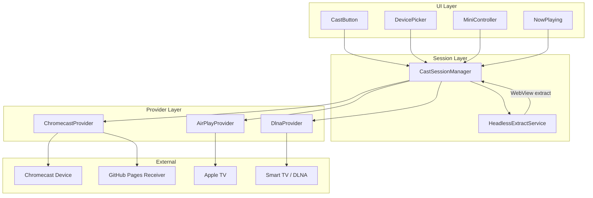
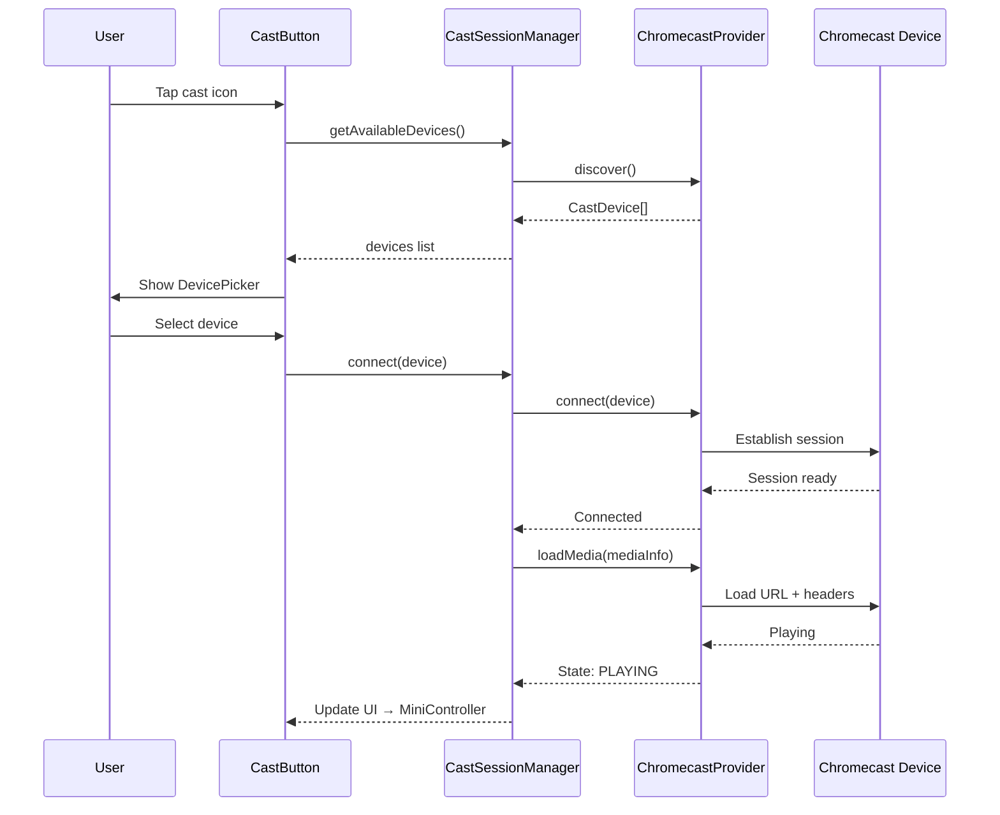
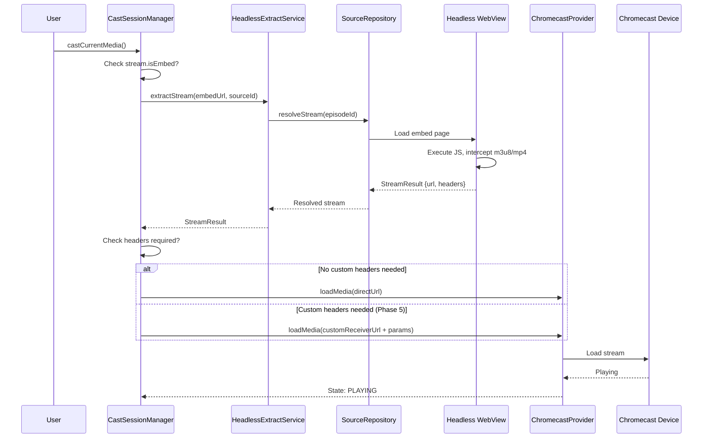

# Design Document: Cast to TV

## Overview

The Cast to TV feature adds the ability to cast video streams from the ReVax mobile app to TV-class devices (Chromecast, Apple TV, DLNA Smart TVs). The architecture uses a three-layer abstraction: a UI layer with cast-aware components, a unified CastSession Manager that exposes a single API for discovery/playback/control, and protocol-specific Provider adapters that implement the actual casting logic.

The feature is phased: Phase 1 delivers Chromecast support via `react-native-google-cast`, Phase 2 adds AirPlay (iOS only), Phase 3 integrates lazy headless stream extraction for embed sources, Phase 4 adds DLNA/UPnP, Phase 5 introduces a custom Chromecast Receiver hosted on GitHub Pages (for custom headers, encrypted HLS, subtitle conversion), and Phase 6 provides a screen-mirror fallback for DRM/non-extractable streams.

A key challenge is that many source plugins return embed URLs requiring webview interaction to extract the actual stream URL. The cast flow must handle both pre-resolved direct streams and on-demand headless extraction transparently.

## Architecture



## Sequence Diagrams

### Cast Flow — Direct Stream (Pre-resolved URL)



### Cast Flow — Embed Source (Lazy Headless Extraction)



## Components and Interfaces

### Component 1: CastSessionManager

**Purpose**: Central orchestrator that manages device discovery, session lifecycle, and media playback commands. UI components interact exclusively with this manager.

**Responsibilities**:
- Run discovery across all registered providers in parallel
- Deduplicate discovered devices by IP + name
- Route commands to the active provider based on connected device
- Maintain canonical cast state (device, playback position, duration, volume)
- Handle stream resolution (direct vs embed) before sending to provider
- Emit state change events for UI reactivity

### Component 2: CastProvider (Interface)

**Purpose**: Protocol-specific adapter that implements the actual casting logic for a given protocol (Chromecast, AirPlay, DLNA).

**Responsibilities**:
- Discover devices on the local network for its protocol
- Establish and tear down connections
- Translate unified media commands into protocol-specific calls
- Report playback state changes back to the manager

### Component 3: HeadlessExtractService

**Purpose**: Resolves embed source URLs into castable direct stream URLs using a headless WebView.

**Responsibilities**:
- Spawn a hidden WebView to load embed pages
- Intercept network requests to detect m3u8/mp4 URLs
- Apply source-specific ad-blocking rules during extraction
- Timeout and report failure if extraction takes too long
- Return resolved StreamResult with URL and required headers

### Component 4: UI Components (CastButton, DevicePicker, MiniController, NowPlaying)

**Purpose**: User-facing cast controls integrated into the existing player and navigation UI.

**Responsibilities**:
- CastButton: Show cast availability, trigger device picker
- DevicePicker: Modal/bottom-sheet listing available devices with protocol icons
- MiniController: Persistent mini-bar showing current cast media with play/pause/stop
- NowPlaying: Full-screen remote control with seek bar, volume, subtitle selection

## Data Models

### CastDevice

```typescript
interface CastDevice {
  id: string;                          // Unique device identifier
  name: string;                        // Human-readable device name
  ip: string;                          // IP address on local network
  port: number;                        // Service port
  protocol: CastProtocol;             // 'chromecast' | 'airplay' | 'dlna'
  model?: string;                      // Device model (e.g., "Chromecast Ultra")
  capabilities: DeviceCapabilities;    // What the device supports
}

type CastProtocol = 'chromecast' | 'airplay' | 'dlna';

interface DeviceCapabilities {
  supportsHls: boolean;
  supportsDash: boolean;
  supportsMp4: boolean;
  supportsSubtitles: boolean;
  supportsCustomHeaders: boolean;      // true only with custom receiver
  maxResolution?: '720p' | '1080p' | '4k';
}
```

### CastSession

```typescript
interface CastSession {
  id: string;                          // Session identifier
  device: CastDevice;                  // Connected device
  state: CastSessionState;            // Current session state
  media: MediaInfo | null;            // Currently loaded media
  startedAt: number;                   // Timestamp session started
}

type CastSessionState = 
  | 'connecting'
  | 'connected'
  | 'loading'
  | 'playing'
  | 'paused'
  | 'buffering'
  | 'idle'
  | 'disconnected'
  | 'error';
```

### MediaInfo

```typescript
interface MediaInfo {
  url: string;                         // Stream URL to cast
  title: string;                       // Media title for display
  subtitle?: string;                   // Episode name or source info
  posterUrl?: string;                  // Thumbnail/poster for receiver UI
  mimeType: string;                    // 'application/x-mpegURL' | 'video/mp4'
  headers?: Record<string, string>;    // Custom headers (requires custom receiver)
  subtitles?: SubtitleTrack[];         // Available subtitle tracks
  startPosition?: number;              // Resume position in seconds
  duration?: number;                   // Total duration if known
  sourceId?: string;                   // Source plugin ID for context
}

interface SubtitleTrack {
  lang: string;                        // Language code
  url: string;                         // Subtitle file URL
  format: 'vtt' | 'srt';             // Original format
}
```

### CastState (Global observable state)

```typescript
interface CastState {
  isAvailable: boolean;                // Any cast device discovered
  isConnected: boolean;                // Currently connected to a device
  session: CastSession | null;         // Active session
  devices: CastDevice[];               // All discovered devices
  playbackPosition: number;            // Current position in seconds
  playbackDuration: number;            // Total duration in seconds
  volume: number;                      // 0.0 - 1.0
  isMuted: boolean;
  error: CastError | null;
}

interface CastError {
  code: CastErrorCode;
  message: string;
  recoverable: boolean;
}

type CastErrorCode =
  | 'DISCOVERY_FAILED'
  | 'CONNECTION_FAILED'
  | 'CONNECTION_LOST'
  | 'MEDIA_LOAD_FAILED'
  | 'EXTRACTION_FAILED'
  | 'EXTRACTION_TIMEOUT'
  | 'UNSUPPORTED_FORMAT'
  | 'HEADERS_REQUIRED'
  | 'DRM_PROTECTED'
  | 'NETWORK_ERROR';
```

## Module Boundaries

New code lives in `modules/cast/` following the existing module pattern:

```
modules/cast/
├── index.ts                    # Public API exports
├── config.ts                   # Module configuration
├── types.ts                    # All type definitions
├── CastSessionManager.ts      # Core manager singleton
├── state.ts                    # Observable CastState (Zustand or EventEmitter)
├── providers/
│   ├── types.ts                # CastProvider interface
│   ├── ChromecastProvider.ts   # Phase 1
│   ├── AirPlayProvider.ts      # Phase 2
│   └── DlnaProvider.ts         # Phase 4
├── extraction/
│   ├── HeadlessExtractService.ts  # Phase 3
│   └── subtitleConverter.ts       # SRT → WebVTT
├── receiver/                      # Phase 5 (hosted on GitHub Pages)
│   ├── index.html
│   ├── receiver.js
│   └── styles.css
└── hooks/
    └── useCastSession.ts       # React hook for UI binding
```

### Integration Points

| Existing Code | Integration |
|---|---|
| `components/movie/MoviePlayer.tsx` | Add CastButton to player controls; when cast active, hide local player and show MiniController |
| `sources/sourceRepository.ts` | HeadlessExtractService calls `resolveStream()` for embed sources |
| `hooks/useSourceMovieDetail.ts` | `useCastSession()` consumes the `stream` state from this hook |
| `app/(tabs)/` (navigation) | MiniController rendered as persistent overlay above tab bar |
| `.github/workflows/` | New `build-android.yml` for dev build (native modules required) |

### Per-Phase Deliverables

| Phase | Deliverables |
|---|---|
| 1 | `ChromecastProvider`, `CastSessionManager`, `CastButton`, `DevicePicker`, `MiniController`, `useCastSession`, Android dev build workflow |
| 2 | `AirPlayProvider`, iOS-specific discovery, platform-conditional provider registration |
| 3 | `HeadlessExtractService`, embed detection in cast flow, loading UI during extraction |
| 4 | `DlnaProvider`, UPnP SSDP discovery |
| 5 | Custom Receiver (HTML/JS on GitHub Pages), header injection, subtitle conversion, `subtitleConverter.ts` |
| 6 | Screen mirror fallback, DRM detection, fallback UI prompt |

## Key Functions with Formal Specifications

### CastProvider Interface

```typescript
interface CastProvider {
  readonly protocol: CastProtocol;

  /**
   * Start discovering devices on the local network.
   * Emits devices as they are found via the callback.
   */
  startDiscovery(onDeviceFound: (device: CastDevice) => void): Promise<void>;

  /**
   * Stop active discovery scan.
   */
  stopDiscovery(): void;

  /**
   * Connect to a specific device.
   */
  connect(device: CastDevice): Promise<CastSession>;

  /**
   * Disconnect from the current device.
   */
  disconnect(): Promise<void>;

  /**
   * Load and play media on the connected device.
   */
  loadMedia(media: MediaInfo): Promise<void>;

  /**
   * Playback controls.
   */
  play(): Promise<void>;
  pause(): Promise<void>;
  stop(): Promise<void>;
  seek(positionSeconds: number): Promise<void>;
  setVolume(level: number): Promise<void>;

  /**
   * Subscribe to state changes from the provider.
   */
  onStateChange(listener: (state: CastSessionState) => void): () => void;

  /**
   * Subscribe to playback position updates.
   */
  onPositionUpdate(listener: (position: number, duration: number) => void): () => void;
}
```

**Preconditions:**
- `startDiscovery`: Network permission granted, WiFi connected
- `connect`: Device must have been returned by `startDiscovery`
- `loadMedia`: Session must be in `connected` or `idle` state
- `seek`: `positionSeconds >= 0 && positionSeconds <= duration`
- `setVolume`: `level >= 0.0 && level <= 1.0`

**Postconditions:**
- `startDiscovery`: Provider is actively scanning; `onDeviceFound` called for each device
- `connect`: Session state transitions to `connected`; returns valid CastSession
- `loadMedia`: Session state transitions to `loading` then `playing`
- `disconnect`: Session state transitions to `disconnected`; all resources released
- `seek`: Playback position updates to requested position (±1s tolerance)
- `setVolume`: Volume level reflects new value on next `onPositionUpdate`

### CastSessionManager

```typescript
class CastSessionManager {
  /**
   * Initialize the manager with available providers.
   * Providers are registered based on platform capabilities.
   */
  static initialize(config: CastConfig): CastSessionManager;

  /**
   * Start parallel discovery across all registered providers.
   * Deduplicates devices by IP + name.
   */
  startDiscovery(): Promise<void>;

  /**
   * Stop all active discovery scans.
   */
  stopDiscovery(): void;

  /**
   * Connect to a device. Routes to the correct provider based on device.protocol.
   */
  connect(device: CastDevice): Promise<void>;

  /**
   * Disconnect from the current device and clean up session.
   */
  disconnect(): Promise<void>;

  /**
   * Cast media to the connected device.
   * Handles stream resolution (direct vs embed) transparently.
   */
  castMedia(params: CastMediaParams): Promise<void>;

  /**
   * Playback controls — delegated to active provider.
   */
  play(): Promise<void>;
  pause(): Promise<void>;
  stop(): Promise<void>;
  seek(positionSeconds: number): Promise<void>;
  setVolume(level: number): Promise<void>;

  /**
   * Get current observable state.
   */
  getState(): CastState;

  /**
   * Subscribe to state changes.
   */
  subscribe(listener: (state: CastState) => void): () => void;
}

interface CastConfig {
  providers: CastProvider[];
  extractionTimeoutMs: number;         // Default: 15000
  customReceiverUrl?: string;          // GitHub Pages URL for Phase 5
  discoveryTimeoutMs: number;          // Default: 10000
}

interface CastMediaParams {
  stream: StreamResult;                // From sourceRepository.resolveStream()
  title: string;
  subtitle?: string;
  posterUrl?: string;
  episodeId: string;
  sourceId: string;
  startPosition?: number;
}
```

**Preconditions:**
- `initialize`: At least one provider must be supplied
- `connect`: Discovery must have been run; device must exist in `state.devices`
- `castMedia`: Must be connected (`state.isConnected === true`)
- `castMedia`: `params.stream` must have a non-empty URL or be an embed requiring extraction

**Postconditions:**
- `startDiscovery`: `state.devices` populated; `state.isAvailable` reflects device count > 0
- `connect`: `state.isConnected === true`; `state.session` is non-null
- `castMedia`: Media loaded on device; state transitions through `loading` → `playing`
- `disconnect`: `state.isConnected === false`; `state.session === null`

**Loop Invariants:**
- Device deduplication: `state.devices` never contains two entries with same `ip + name`
- Provider routing: Commands always dispatched to provider matching `session.device.protocol`

### HeadlessExtractService

```typescript
class HeadlessExtractService {
  /**
   * Extract a direct stream URL from an embed source.
   * Spawns a hidden WebView, loads the embed page, intercepts network
   * requests to find m3u8/mp4 URLs.
   */
  extractStream(params: ExtractionParams): Promise<StreamResult>;

  /**
   * Cancel an in-progress extraction.
   */
  cancel(): void;

  /**
   * Check if a stream requires extraction (is embed).
   */
  static needsExtraction(stream: StreamResult): boolean;
}

interface ExtractionParams {
  embedUrl: string;
  sourceId: string;
  headers?: Record<string, string>;
  timeoutMs?: number;                  // Default: 15000
}
```

**Preconditions:**
- `extractStream`: `params.embedUrl` is a valid HTTP(S) URL
- `extractStream`: Network connectivity available
- `needsExtraction`: `stream` is non-null

**Postconditions:**
- `extractStream` success: Returns `StreamResult` with `isEmbed === false` and valid `url`
- `extractStream` timeout: Throws `CastError` with code `EXTRACTION_TIMEOUT`
- `extractStream` failure: Throws `CastError` with code `EXTRACTION_FAILED`
- `needsExtraction`: Returns `true` iff `stream.isEmbed === true` or URL is not a direct stream pattern

### useCastSession Hook

```typescript
function useCastSession(): {
  state: CastState;
  startDiscovery: () => Promise<void>;
  stopDiscovery: () => void;
  connect: (device: CastDevice) => Promise<void>;
  disconnect: () => Promise<void>;
  castMedia: (params: CastMediaParams) => Promise<void>;
  play: () => Promise<void>;
  pause: () => Promise<void>;
  stop: () => Promise<void>;
  seek: (position: number) => Promise<void>;
  setVolume: (level: number) => Promise<void>;
};
```

**Preconditions:**
- Hook must be called within a React component tree
- CastSessionManager must be initialized (via provider at app root)

**Postconditions:**
- `state` always reflects the latest CastState from the manager
- All methods delegate to CastSessionManager singleton
- Re-renders component on any state change

### UI Component Signatures

```typescript
// CastButton — shown in player controls and movie detail header
interface CastButtonProps {
  size?: number;                       // Icon size, default 24
  color?: string;                      // Icon color
  style?: ViewStyle;
}

// DevicePicker — modal/bottom-sheet for device selection
interface DevicePickerProps {
  visible: boolean;
  onClose: () => void;
  onDeviceSelected: (device: CastDevice) => void;
}

// MiniController — persistent bar above tab navigation
interface MiniControllerProps {
  onExpand: () => void;                // Navigate to NowPlaying
}

// NowPlaying — full-screen remote control
interface NowPlayingProps {
  onClose: () => void;
}
```

### Subtitle Converter (SRT → WebVTT)

```typescript
/**
 * Convert SRT subtitle content to WebVTT format.
 * Chromecast requires WebVTT; many sources provide SRT.
 */
function convertSrtToWebVtt(srtContent: string): string;

/**
 * Fetch a subtitle URL, detect format, convert to WebVTT if needed,
 * and return a data URI or hosted URL suitable for casting.
 */
async function resolveSubtitleForCast(
  track: SubtitleTrack,
  headers?: Record<string, string>,
): Promise<string>; // Returns WebVTT URL (data: URI or proxied)
```

**Preconditions:**
- `convertSrtToWebVtt`: Input is valid SRT format (numbered blocks with timestamps)
- `resolveSubtitleForCast`: `track.url` is accessible

**Postconditions:**
- `convertSrtToWebVtt`: Output starts with "WEBVTT" header; all timestamps converted from comma to dot separator
- `resolveSubtitleForCast`: Returns a URL loadable by Chromecast receiver without CORS issues

### Custom Chromecast Receiver (Phase 5)

```typescript
// Communication protocol between sender (app) and custom receiver (HTML on GitHub Pages)

// Message from sender → receiver (via CastChannel)
type SenderMessage =
  | { type: 'LOAD'; payload: ReceiverLoadPayload }
  | { type: 'PLAY' }
  | { type: 'PAUSE' }
  | { type: 'SEEK'; position: number }
  | { type: 'STOP' }
  | { type: 'SET_VOLUME'; level: number }
  | { type: 'SET_SUBTITLE'; trackIndex: number | null };

interface ReceiverLoadPayload {
  url: string;                         // Stream URL (m3u8 or mp4)
  headers: Record<string, string>;     // Custom headers (Referer, User-Agent, etc.)
  mimeType: string;
  title: string;
  subtitle?: string;
  posterUrl?: string;
  subtitles?: ReceiverSubtitleTrack[];
  startPosition?: number;
}

interface ReceiverSubtitleTrack {
  lang: string;
  url: string;                         // Must be WebVTT format
  label: string;
}

// Message from receiver → sender (status updates)
type ReceiverMessage =
  | { type: 'STATUS'; state: 'loading' | 'playing' | 'paused' | 'buffering' | 'idle' | 'error' }
  | { type: 'POSITION'; position: number; duration: number }
  | { type: 'ERROR'; code: string; message: string };
```

**Receiver HTML/JS Structure:**
```
receiver/
├── index.html          # CAF receiver shell, loads receiver.js
├── receiver.js         # Custom receiver logic:
│                       #   - Intercepts LOAD to inject headers via fetch + MediaSource
│                       #   - Uses hls.js for HLS with custom xhr headers
│                       #   - Handles subtitle track switching
│                       #   - Reports position/state back to sender
└── styles.css          # Minimal receiver UI (poster, title, loading spinner)
```

**Header Injection Strategy:**
- The custom receiver uses `hls.js` with `xhrSetup` callback to inject custom headers on every segment/manifest request
- For MP4: uses `fetch()` with headers → `MediaSource` API
- Hosted on GitHub Pages at `https://<user>.github.io/revax-cast-receiver/`

### Proxy Server for AirPlay Header Passthrough

```typescript
/**
 * Local HTTP proxy that adds custom headers to outgoing requests.
 * Used for AirPlay which cannot send custom headers natively.
 * Runs on the device and proxies HLS manifest + segments.
 */
interface LocalProxyServer {
  start(port: number): Promise<string>;  // Returns base URL like http://localhost:8765
  stop(): Promise<void>;
  
  /**
   * Register a stream to proxy. Returns a local URL that AirPlay can use.
   * The proxy will forward requests to the real URL with injected headers.
   */
  registerStream(params: {
    originalUrl: string;
    headers: Record<string, string>;
    mimeType: string;
  }): string;  // Returns proxied URL like http://localhost:8765/stream/abc123
}
```

**Preconditions:**
- `start`: Port must be available on localhost
- `registerStream`: Proxy must be running

**Postconditions:**
- `start`: HTTP server listening on specified port
- `registerStream`: Returned URL serves same content as `originalUrl` but with headers injected
- `stop`: All connections closed, port released

## Algorithmic Pseudocode

### Device Discovery with Deduplication

```typescript
async function discoverDevices(providers: CastProvider[]): Promise<CastDevice[]> {
  // PRECONDITION: providers.length > 0
  // POSTCONDITION: returned array has no duplicates by (ip + name)
  
  const deviceMap = new Map<string, CastDevice>(); // key = `${ip}:${name}`
  
  const discoveryPromises = providers.map(provider => {
    return new Promise<void>((resolve) => {
      const timeout = setTimeout(resolve, DISCOVERY_TIMEOUT_MS);
      
      provider.startDiscovery((device) => {
        // LOOP INVARIANT: deviceMap contains only unique devices
        const key = `${device.ip}:${device.name}`;
        if (!deviceMap.has(key)) {
          deviceMap.set(key, device);
        }
      });
      
      // Resolve after timeout regardless
      setTimeout(() => {
        provider.stopDiscovery();
        clearTimeout(timeout);
        resolve();
      }, DISCOVERY_TIMEOUT_MS);
    });
  });
  
  await Promise.all(discoveryPromises);
  
  return Array.from(deviceMap.values());
}
```

### Cast Media Resolution Algorithm

```typescript
async function resolveCastableStream(
  params: CastMediaParams,
  extractService: HeadlessExtractService,
  session: CastSession,
): Promise<MediaInfo> {
  // PRECONDITION: params.stream is non-null
  // PRECONDITION: session.state === 'connected' || session.state === 'idle'
  // POSTCONDITION: returned MediaInfo.url is a direct stream URL (not embed)
  
  let resolvedStream: StreamResult;
  
  // Step 1: Determine if extraction is needed
  if (HeadlessExtractService.needsExtraction(params.stream)) {
    // Embed source — run headless extraction
    resolvedStream = await extractService.extractStream({
      embedUrl: params.stream.url,
      sourceId: params.sourceId,
      headers: params.stream.headers,
    });
  } else {
    // Direct stream — use as-is
    resolvedStream = params.stream;
  }
  
  // Step 2: Determine if custom headers are needed
  const needsHeaders = resolvedStream.headers && 
    Object.keys(resolvedStream.headers).length > 0;
  const deviceSupportsHeaders = session.device.capabilities.supportsCustomHeaders;
  
  // Step 3: Choose delivery strategy
  let finalUrl: string;
  let mimeType: string;
  
  if (needsHeaders && !deviceSupportsHeaders) {
    // Device cannot handle headers — error for now, Phase 5/proxy solves this
    throw new CastError('HEADERS_REQUIRED', 
      'This stream requires custom headers. Use custom receiver or proxy.');
  }
  
  finalUrl = resolvedStream.url;
  mimeType = resolvedStream.mimeType ?? inferMimeType(resolvedStream.url);
  
  // Step 4: Resolve subtitles (convert SRT → WebVTT)
  const subtitles: SubtitleTrack[] = [];
  if (resolvedStream.subtitles) {
    for (const sub of resolvedStream.subtitles) {
      const format = sub.url.endsWith('.srt') ? 'srt' : 'vtt';
      subtitles.push({ lang: sub.lang, url: sub.url, format });
    }
  }
  
  // POSTCONDITION: finalUrl matches /\.(m3u8|mp4)(\?|$)/i or is a valid stream
  return {
    url: finalUrl,
    title: params.title,
    subtitle: params.subtitle,
    posterUrl: params.posterUrl,
    mimeType,
    headers: needsHeaders ? resolvedStream.headers : undefined,
    subtitles,
    startPosition: params.startPosition,
    sourceId: params.sourceId,
  };
}

function inferMimeType(url: string): string {
  if (/\.m3u8(\?|$)/i.test(url)) return 'application/x-mpegURL';
  if (/\.mp4(\?|$)/i.test(url)) return 'video/mp4';
  if (/\.mpd(\?|$)/i.test(url)) return 'application/dash+xml';
  return 'application/x-mpegURL'; // Default to HLS
}
```

### SRT to WebVTT Conversion Algorithm

```typescript
function convertSrtToWebVtt(srtContent: string): string {
  // PRECONDITION: srtContent is non-empty string in SRT format
  // POSTCONDITION: output starts with "WEBVTT\n\n"
  // POSTCONDITION: all timestamps use '.' as millisecond separator (not ',')
  // POSTCONDITION: cue count in output === cue count in input
  
  const lines = srtContent.replace(/\r\n/g, '\n').split('\n');
  const output: string[] = ['WEBVTT', '', ''];
  
  let i = 0;
  while (i < lines.length) {
    // LOOP INVARIANT: output contains valid WebVTT up to current position
    
    // Skip blank lines and cue numbers
    if (lines[i].trim() === '' || /^\d+$/.test(lines[i].trim())) {
      i++;
      continue;
    }
    
    // Timestamp line: "00:01:23,456 --> 00:01:25,789"
    const timestampMatch = lines[i].match(
      /(\d{2}:\d{2}:\d{2}),(\d{3})\s*-->\s*(\d{2}:\d{2}:\d{2}),(\d{3})/
    );
    
    if (timestampMatch) {
      // Convert comma to dot for WebVTT
      output.push(`${timestampMatch[1]}.${timestampMatch[2]} --> ${timestampMatch[3]}.${timestampMatch[4]}`);
      i++;
      
      // Collect text lines until blank line
      while (i < lines.length && lines[i].trim() !== '') {
        output.push(lines[i]);
        i++;
      }
      output.push(''); // Blank line between cues
    } else {
      i++;
    }
  }
  
  return output.join('\n');
}
```

### State Machine Transitions

```typescript
// Valid state transitions for CastSessionState
const VALID_TRANSITIONS: Record<CastSessionState, CastSessionState[]> = {
  disconnected: ['connecting'],
  connecting:   ['connected', 'error', 'disconnected'],
  connected:    ['loading', 'idle', 'disconnected'],
  loading:      ['playing', 'error', 'disconnected'],
  playing:      ['paused', 'buffering', 'idle', 'error', 'disconnected'],
  paused:       ['playing', 'buffering', 'idle', 'error', 'disconnected'],
  buffering:    ['playing', 'paused', 'error', 'disconnected'],
  idle:         ['loading', 'disconnected'],
  error:        ['connecting', 'disconnected', 'idle'],
};

function transitionState(current: CastSessionState, next: CastSessionState): CastSessionState {
  // PRECONDITION: current is a valid CastSessionState
  // POSTCONDITION: returned state is either `next` (if valid) or `current` (if invalid)
  
  const allowed = VALID_TRANSITIONS[current];
  if (allowed.includes(next)) {
    return next;
  }
  
  // Invalid transition — log warning, stay in current state
  console.warn(`[CastState] Invalid transition: ${current} → ${next}`);
  return current;
}
```

## Example Usage

```typescript
// === App initialization (app/_layout.tsx) ===
import { CastSessionManager } from '@/modules/cast';
import { ChromecastProvider } from '@/modules/cast/providers/ChromecastProvider';

// Initialize on app start
const castManager = CastSessionManager.initialize({
  providers: [new ChromecastProvider()],
  extractionTimeoutMs: 15000,
  discoveryTimeoutMs: 10000,
});

// === In MoviePlayer.tsx — adding cast button ===
import { CastButton } from '@/modules/cast/components/CastButton';
import { useCastSession } from '@/modules/cast/hooks/useCastSession';

function MoviePlayerControls({ stream, detail }: Props) {
  const { state, castMedia } = useCastSession();

  const handleCast = async () => {
    await castMedia({
      stream,
      title: detail.title,
      subtitle: detail.episodeCurrent,
      posterUrl: detail.posterUrl,
      episodeId: currentEpisodeId,
      sourceId: detail.sourceId,
    });
  };

  return (
    <View>
      <CastButton onPress={handleCast} />
      {state.isConnected && <MiniController onExpand={openNowPlaying} />}
    </View>
  );
}

// === Headless extraction for embed sources ===
import { HeadlessExtractService } from '@/modules/cast/extraction/HeadlessExtractService';

// When user taps cast on an embed source:
const extractService = new HeadlessExtractService();
const resolved = await extractService.extractStream({
  embedUrl: 'https://embed.example.com/player/12345',
  sourceId: 'nguonc',
  headers: { Referer: 'https://nguonc.com/' },
  timeoutMs: 15000,
});
// resolved.url = 'https://cdn.example.com/stream.m3u8'
// resolved.isEmbed = false

// === Subtitle conversion ===
import { convertSrtToWebVtt } from '@/modules/cast/extraction/subtitleConverter';

const srt = `1
00:00:01,000 --> 00:00:04,000
Hello world

2
00:00:05,000 --> 00:00:08,000
This is a subtitle`;

const vtt = convertSrtToWebVtt(srt);
// "WEBVTT\n\n00:00:01.000 --> 00:00:04.000\nHello world\n\n..."
```

## Correctness Properties

*A property is a characteristic or behavior that should hold true across all valid executions of a system—essentially, a formal statement about what the system should do. Properties serve as the bridge between human-readable specifications and machine-verifiable correctness guarantees.*

### Property 1: Device deduplication is order-independent

*For any* list of discovered devices (potentially containing duplicates by IP + name), deduplication produces the same result regardless of the order devices are discovered.

**Validates: Requirements 1.2**

### Property 2: Discovery availability reflects device count

*For any* discovery result, `state.isAvailable` equals `true` if and only if `state.devices.length > 0`.

**Validates: Requirements 1.3, 1.4**

### Property 3: State machine validity

*For any* sequence of state transition requests, the CastSession state is always a member of the defined `CastSessionState` set, and every applied transition follows the `VALID_TRANSITIONS` map. Invalid transitions leave the state unchanged.

**Validates: Requirements 5.1, 5.2, 5.3**

### Property 4: No orphaned sessions

*For any* CastState where `isConnected === false`, the `session` field is always `null`.

**Validates: Requirements 5.4, 2.4**

### Property 5: Provider routing correctness

*For any* connected device with protocol P, all playback commands are dispatched exclusively to the provider whose `protocol === P`, and never to any other provider.

**Validates: Requirements 2.1, 2.5**

### Property 6: Volume clamping

*For any* numeric value `v` passed to `setVolume(v)`, the resulting `state.volume` is always within the range `[0.0, 1.0]`.

**Validates: Requirements 4.4**

### Property 7: Seek clamping

*For any* numeric value `pos` passed to `seek(pos)`, the resulting playback position is always within the range `[0, state.playbackDuration]`.

**Validates: Requirements 4.3**

### Property 8: SRT→WebVTT cue preservation

*For any* valid SRT input, `convertSrtToWebVtt` produces output where the number of cue blocks equals the number of cue blocks in the input.

**Validates: Requirements 7.4**

### Property 9: SRT→WebVTT timestamp format

*For any* valid SRT input, all timestamps in the WebVTT output use `.` (dot) as the millisecond separator, and no timestamp contains `,` (comma).

**Validates: Requirements 7.3**

### Property 10: SRT→WebVTT header

*For any* input to `convertSrtToWebVtt`, the output always starts with the string `"WEBVTT"`.

**Validates: Requirements 7.2**

### Property 11: MIME type inference consistency

*For any* URL string, `inferMimeType` returns `'application/x-mpegURL'` if the URL contains `.m3u8`, `'video/mp4'` if it contains `.mp4`, `'application/dash+xml'` if it contains `.mpd`, and defaults to `'application/x-mpegURL'` otherwise — regardless of query parameters or fragments.

**Validates: Requirements 10.1, 10.2, 10.3, 10.4**

### Property 12: Extraction result is always direct

*For any* successful call to `HeadlessExtractService.extractStream`, the returned StreamResult has `isEmbed === false` (the result is never an embed URL).

**Validates: Requirements 6.2**

### Property 13: Extraction timeout guarantee

*For any* call to `HeadlessExtractService.extractStream` with a configured `timeoutMs`, the promise always resolves or rejects within `timeoutMs + 1000ms` (grace period for cleanup).

**Validates: Requirements 6.3**

### Property 14: Discovery freshness

*For any* sequence of `stopDiscovery()` followed by `startDiscovery()`, the new discovery produces a fresh scan with no stale devices from previous runs.

**Validates: Requirements 1.6**

### Property 15: Connect/disconnect symmetry

*For any* device, a sequence of `connect(device)` followed by `disconnect()` results in `state.isConnected === false` and `state.session === null` with all listeners removed and timers cleared.

**Validates: Requirements 2.4**

### Property 16: Parallel discovery protocol isolation

*For any* set of providers running discovery concurrently, each discovered device's `protocol` field matches the protocol of the provider that discovered it — devices from one provider never appear under another provider's protocol.

**Validates: Requirements 14.4**

### Property 17: Sender message serialization round-trip

*For any* valid `SenderMessage` object, serializing to JSON and deserializing back produces an identical message object.

**Validates: Requirements 12.3**

### Property 18: Subtitle format-based routing

*For any* subtitle track URL ending in `.srt`, `resolveSubtitleForCast` performs WebVTT conversion; *for any* URL ending in `.vtt`, it passes the URL through unchanged.

**Validates: Requirements 7.5, 7.6**

### Property 19: Proxy URL uniqueness

*For any* set of distinct stream registration parameters, each call to `LocalProxyServer.registerStream` returns a unique URL path that does not collide with any other registered stream.

**Validates: Requirements 13.2**

### Property 20: Headers-required error for unsupported devices

*For any* stream that requires custom headers cast to a device where `capabilities.supportsCustomHeaders === false`, the CastSessionManager throws a CastError with code `HEADERS_REQUIRED`.

**Validates: Requirements 3.4**

## Error Handling

### Error Scenario 1: Stream Extraction Timeout

**Condition**: Headless WebView does not intercept a stream URL within `timeoutMs`
**Response**: Throw `CastError` with code `EXTRACTION_TIMEOUT`; destroy WebView instance
**Recovery**: UI offers retry or screen-mirror fallback (Phase 6)

### Error Scenario 2: Connection Lost During Playback

**Condition**: Provider reports device disconnected unexpectedly
**Response**: Transition state to `disconnected`; emit error event
**Recovery**: Show reconnect prompt; if user accepts, attempt `connect()` to same device and `loadMedia()` at last known position

### Error Scenario 3: Headers Required but No Custom Receiver

**Condition**: Stream requires custom headers but device doesn't support them (pre-Phase 5)
**Response**: Throw `CastError` with code `HEADERS_REQUIRED`
**Recovery**: UI shows message explaining limitation; offers screen-mirror fallback

### Error Scenario 4: DRM/Encrypted Stream Detected

**Condition**: Stream URL indicates DRM (Widevine, FairPlay) or extraction yields encrypted content
**Response**: Throw `CastError` with code `DRM_PROTECTED`
**Recovery**: Offer screen-mirror fallback (Phase 6)

### Error Scenario 5: No Devices Found

**Condition**: Discovery completes with zero devices across all providers
**Response**: `state.isAvailable = false`; no error thrown
**Recovery**: UI shows "No devices found" with troubleshooting tips (check WiFi, ensure device is on same network)

## Testing Strategy

### Unit Testing Approach

- Test `convertSrtToWebVtt` with various SRT formats (multi-line cues, HTML tags, empty lines)
- Test `inferMimeType` with edge cases (query params, fragments, uppercase extensions)
- Test `transitionState` for all valid and invalid transitions
- Test device deduplication logic with duplicate IPs, duplicate names, mixed protocols
- Test `CastMediaParams` validation (null stream, missing fields)

### Property-Based Testing Approach

**Property Test Library**: `fast-check`

Key properties to test with generated inputs:
- SRT conversion preserves cue count (generate random SRT blocks)
- State machine never reaches an invalid state (generate random transition sequences)
- Volume/seek clamping always produces values in valid range (generate random floats)
- Device deduplication is order-independent (generate device lists, shuffle, compare results)
- Proxy URL generation never collides (generate random stream params)

### Integration Testing Approach

- Mock `react-native-google-cast` native module to test ChromecastProvider flow
- Test full cast flow: resolve stream → connect → load → play → seek → disconnect
- Test extraction service with mock WebView that simulates network interception
- Test custom receiver message protocol with mock CastChannel

## Performance Considerations

- **Discovery**: Run all providers in parallel with a shared timeout; don't block UI
- **Extraction**: Show loading indicator; cap at 15s timeout; cache extracted URLs for session duration
- **Position updates**: Throttle to 1 update/second to avoid excessive re-renders
- **Subtitle conversion**: Perform once on cast start, cache result; SRT files are typically <100KB
- **Proxy server** (Phase 5): Only start when AirPlay + headers needed; stop when cast ends
- **Memory**: Destroy headless WebView immediately after extraction completes

## Security Considerations

- **Local proxy**: Bind to `127.0.0.1` only; reject connections from non-localhost
- **Custom receiver**: Hosted on HTTPS (GitHub Pages); no secrets in receiver code
- **Stream URLs**: Never log full stream URLs in production (may contain tokens)
- **Headers**: Custom headers (Referer, tokens) transmitted only to trusted receiver or local proxy
- **WebView extraction**: Apply same ad-block rules as regular player; sandbox WebView (no JS alerts, no navigation away from embed domain)

## Dependencies

| Dependency | Purpose | Phase |
|---|---|---|
| `react-native-google-cast` | Chromecast SDK bridge for React Native | 1 |
| `@react-native-community/netinfo` | Network state detection (WiFi check) | 1 |
| `react-native-airplay-btn` or custom native module | AirPlay route picker | 2 |
| `react-native-webview` (existing) | Headless extraction WebView | 3 |
| `hls.js` | HLS playback in custom receiver with header injection | 5 |
| `react-native-tcp-socket` or `expo-server` | Local proxy server for AirPlay | 5 |
| DLNA/UPnP library (TBD) | SSDP discovery + SOAP control | 4 |
