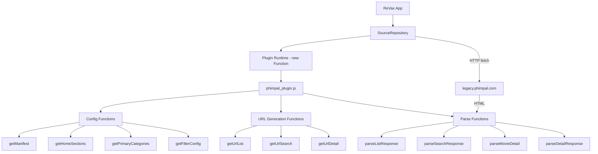

# Design Document: PhimPal Plugin

## Overview

The PhimPal plugin is a vanilla JavaScript (ES5-only) module that integrates with the ReVax plugin runtime to parse and stream movie/TV show content from `https://legacy.phimpal.com`. It follows the same contract as existing plugins (animevietsub, kkphim, etc.) — executed via `new Function()`, no imports, regex-based HTML parsing, no DOM APIs.

Key design decisions:
- **legacy.phimpal.com as primary source**: The legacy site renders HTML server-side, making regex parsing reliable. The main `phimpal.com` is a SPA and unsuitable for this approach.
- **Flat URL structure**: PhimPal uses `/movie/{slug}~{id}` and `/tv/{slug}~{id}/season/{n}` patterns, distinct from other plugins' `/phim/{slug}` convention.
- **Season-aware TV show handling**: TV shows have explicit season entities, each with its own episode list. The plugin maps seasons as "server" entries (matching the existing `SourceServer` interface) and episodes within each season page.
- **TMDB poster URLs**: Poster images come from `image.tmdb.org` rather than an internal CDN, so they are preserved as absolute URLs.
- **Subtitle support**: Watch pages may include `<track>` elements or inline JS subtitle metadata for Vietnamese and English tracks.

## Architecture



The plugin operates as a pure data transformation layer:
1. **SourceRepository** calls URL generation functions to get fetch targets
2. **SourceRepository** fetches HTML from the generated URLs
3. **SourceRepository** passes raw HTML to parse functions
4. Parse functions return JSON strings conforming to the expected interfaces

The plugin itself never makes network requests — all I/O is handled by the host runtime.

## Components and Interfaces

### Plugin Functions (Public API)

| Function | Input | Output | Purpose |
|----------|-------|--------|---------|
| `getManifest()` | none | JSON string | Plugin identity and capabilities |
| `getHomeSections()` | none | JSON string (array) | Home screen section config |
| `getPrimaryCategories()` | none | JSON string (array) | Genre categories |
| `getFilterConfig()` | none | JSON string (object) | Filter options (sort, category, country, year) |
| `getUrlList(slug, filtersJson)` | slug: string, filtersJson: string | URL string | Listing page URL |
| `getUrlSearch(keyword, filtersJson)` | keyword: string, filtersJson: string | URL string | Search URL |
| `getUrlDetail(slug)` | slug: string | URL string | Detail/watch page URL |
| `parseListResponse(html)` | html: string | JSON string | Parse listing HTML into items + pagination |
| `parseSearchResponse(html)` | html: string | JSON string | Parse search HTML into items + pagination |
| `parseMovieDetail(html)` | html: string | JSON string or "null" | Parse movie/show/season detail |
| `parseDetailResponse(html)` | html: string | JSON string or "{}" | Parse watch page into stream result |

### Internal Utilities (Private)

| Utility | Purpose |
|---------|---------|
| `cleanText(text)` | Strip HTML tags, decode entities, normalize whitespace |
| `decodeEntities(str)` | Decode `&amp;`, `&lt;`, `&#NNN;`, etc. |
| `extractPagination(html)` | Extract currentPage/totalPages from pagination links |
| `absoluteUrl(url)` | Prepend base URL to relative paths |

### Data Flow for Key Scenarios

**Movie Listing Flow:**
```
getUrlList("type/movie", '{"page":2}')
  → "https://legacy.phimpal.com/type/movie?page=2"
  → [SourceRepository fetches HTML]
  → parseListResponse(html)
  → '{"items":[...],"pagination":{"currentPage":2,"totalPages":10}}'
```

**TV Show Detail Flow:**
```
getUrlDetail("tv/breaking-bad~4586")
  → "https://legacy.phimpal.com/tv/breaking-bad~4586"
  → [fetch HTML]
  → parseMovieDetail(html)
  → '{"title":"Breaking Bad","servers":[{"name":"Phần 1","episodes":[{"id":"tv/breaking-bad~4586/season/1","slug":"tv/breaking-bad~4586/season/1","name":"Phần 1"}]},...]}'
```

**Season → Episodes Flow:**
```
getUrlDetail("tv/breaking-bad~4586/season/1")
  → "https://legacy.phimpal.com/tv/breaking-bad~4586/season/1"
  → [fetch HTML]
  → parseMovieDetail(html)
  → '{"title":"Breaking Bad","servers":[{"name":"PhimPal","episodes":[{"id":"watch/12345","slug":"watch/12345","name":"Tập 1: Pilot"},...]}'
```

**Stream Resolution Flow:**
```
getUrlDetail("watch/12345")
  → "https://legacy.phimpal.com/watch/12345"
  → [fetch HTML]
  → parseDetailResponse(html)
  → '{"url":"https://...m3u8","isEmbed":false,"headers":{"Referer":"https://legacy.phimpal.com/","User-Agent":"..."},"subtitles":[{"lang":"vi","url":"..."}]}'
```

## Data Models

### Manifest Object
```javascript
{
  id: "phimpal",
  name: "PhimPal",
  version: "1.0.0",
  baseUrl: "https://legacy.phimpal.com",
  iconUrl: "https://raw.githubusercontent.com/youngbi/repo/main/plugins/phimpal.png",
  isEnabled: true,
  isAdult: false,
  type: "MOVIE",
  layoutType: "VERTICAL"
}
```

### List/Search Response
```javascript
{
  items: [
    {
      id: "movie/the-matrix~68781",       // path portion from href
      title: "The Matrix",                  // English title
      originName: "Ma Trận",               // Vietnamese title
      posterUrl: "https://image.tmdb.org/t/p/w500/...",
      episode_current: "Tập 5"            // or "" for movies
    }
  ],
  pagination: {
    currentPage: 1,
    totalPages: 10
  }
}
```

### Movie Detail Response
```javascript
{
  title: "The Matrix",
  originName: "Ma Trận",
  posterUrl: "https://image.tmdb.org/t/p/w500/...",
  description: "A computer hacker learns...",
  year: 1999,
  rating: 8.7,
  duration: "2 giờ 16 phút",
  category: "Hành Động, Khoa Học Viễn Tưởng",
  country: "Mỹ",
  director: "Lana Wachowski, Lilly Wachowski",
  casts: "Keanu Reeves, Laurence Fishburne",
  servers: [
    {
      name: "PhimPal",
      episodes: [
        { id: "watch/68781", slug: "watch/68781", name: "Tập 1" }
      ]
    }
  ]
}
```

### TV Show Detail Response (Show Page)
```javascript
{
  title: "Breaking Bad",
  originName: "Tập Làm Người Xấu",
  // ... metadata fields same as movie ...
  servers: [
    {
      name: "Phần 1",
      episodes: [
        { id: "tv/breaking-bad~4586/season/1", slug: "tv/breaking-bad~4586/season/1", name: "Phần 1" }
      ]
    },
    {
      name: "Phần 2",
      episodes: [
        { id: "tv/breaking-bad~4586/season/2", slug: "tv/breaking-bad~4586/season/2", name: "Phần 2" }
      ]
    }
  ]
}
```

### Season Detail Response (Season Page)
```javascript
{
  title: "Breaking Bad",
  // ... metadata ...
  servers: [
    {
      name: "PhimPal",
      episodes: [
        { id: "watch/10001", slug: "watch/10001", name: "Tập 1: Pilot" },
        { id: "watch/10002", slug: "watch/10002", name: "Tập 2: Cat's in the Bag..." }
      ]
    }
  ]
}
```

### Stream Result
```javascript
{
  url: "https://stream.phimpal.com/.../master.m3u8",
  isEmbed: false,
  headers: {
    "Referer": "https://legacy.phimpal.com/",
    "User-Agent": "Mozilla/5.0 (Windows NT 10.0; Win64; x64) AppleWebKit/537.36 (KHTML, like Gecko) Chrome/120.0.0.0 Safari/537.36"
  },
  subtitles: [
    { lang: "vi", url: "https://legacy.phimpal.com/subtitles/vi/12345.vtt" },
    { lang: "en", url: "https://legacy.phimpal.com/subtitles/en/12345.vtt" }
  ]
}
```

### Filter Config Object
```javascript
{
  sort: [
    { name: "Mới nhất", value: "latest" },
    { name: "Xem nhiều nhất", value: "most-viewed" },
    { name: "Đánh giá cao", value: "rating" }
  ],
  category: [
    { name: "Hành Động", value: "hanh-dong" },
    { name: "Phiêu Lưu", value: "phieu-luu" },
    // ... more genres
  ],
  country: [
    { name: "Mỹ", value: "US" },
    { name: "Hàn Quốc", value: "KR" },
    // ... more countries
  ],
  year: [
    { name: "2026", value: "2026" },
    { name: "2025", value: "2025" },
    // ... down to 2000
  ]
}
```

### URL Generation Logic (Filter Precedence)

```
Input: (slug, filtersJson) where filtersJson = { page, category, country, year, sort }

Priority order for path construction:
1. category → /genre/{category-slug}
2. country  → /country/{country-code}
3. year     → /year/{year}
4. slug     → /{slug}  (fallback to /browse if empty)

Page appended as ?page={n} only when n > 1
```

## Correctness Properties

*A property is a characteristic or behavior that should hold true across all valid executions of a system — essentially, a formal statement about what the system should do. Properties serve as the bridge between human-readable specifications and machine-verifiable correctness guarantees.*

### Property 1: URL list generation respects filter precedence

*For any* slug string, and *for any* filtersJson containing arbitrary combinations of category, country, year, and page values, `getUrlList` SHALL produce a URL whose path segment reflects exactly the highest-priority non-empty valid filter (category > country > year > slug-based path), and SHALL append `?page={n}` only when page is an integer greater than 1.

**Validates: Requirements 5.1, 5.3, 5.4, 5.5, 5.8, 5.9**

### Property 2: URL list generation is error-resilient

*For any* input where filtersJson is null, undefined, an invalid JSON string, or contains a page value that is not a positive integer, `getUrlList` SHALL return a valid URL string starting with "https://legacy.phimpal.com/" without throwing an exception.

**Validates: Requirements 5.6**

### Property 3: Search URL correctly encodes keywords

*For any* keyword string (including Unicode characters, spaces, special characters, and empty strings) and *for any* filtersJson with a page value, `getUrlSearch` SHALL return a URL starting with "https://legacy.phimpal.com/search?q=" followed by the URL-encoded keyword, with "&page={n}" appended only when page is an integer greater than 1.

**Validates: Requirements 6.1, 6.2, 6.3**

### Property 4: Detail URL construction prepends base or passes through absolute URLs

*For any* slug string that does not start with "http://" or "https://", `getUrlDetail` SHALL return "https://legacy.phimpal.com/" concatenated with the slug. *For any* slug that starts with "http://" or "https://", `getUrlDetail` SHALL return the slug unchanged.

**Validates: Requirements 7.1, 7.2, 7.3, 7.4, 7.5**

### Property 5: Listing and search parsing extracts valid items preserving document order

*For any* HTML string containing anchor elements with hrefs matching `/movie/{slug}~{id}` or `/tv/{slug}~{id}`, `parseListResponse` (and `parseSearchResponse`) SHALL extract items where each item's `id` equals the path portion of the href, `title` equals the decoded anchor text, and items appear in the same order as in the source HTML. Items with missing/empty href or title SHALL be excluded.

**Validates: Requirements 8.1, 8.4, 8.5, 9.1, 9.4, 17.4**

### Property 6: Poster URL normalization

*For any* poster URL extracted from HTML, if the URL starts with "https://" it SHALL be preserved unchanged in the output; if it starts with "/" it SHALL be prepended with "https://legacy.phimpal.com" to form an absolute URL.

**Validates: Requirements 8.2**

### Property 7: Movie detail metadata extraction

*For any* HTML containing an H1 element with title text, `parseMovieDetail` SHALL extract the title and return a valid JSON object. When metadata fields (originName, posterUrl, description, year, rating, category, country, director, casts, duration) are present in the HTML, they SHALL be correctly extracted. When a field is absent, it SHALL default to empty string (for strings) or 0 (for numbers).

**Validates: Requirements 10.1, 10.2, 10.3, 17.1**

### Property 8: TV show season-to-server mapping preserves order

*For any* TV show detail HTML containing season links matching `/tv/{slug}~{id}/season/{n}`, `parseMovieDetail` SHALL produce a servers array where each server represents one season with name "Phần {n}", and the seasons appear in the same order as in the HTML. Season links not matching the expected pattern SHALL be skipped.

**Validates: Requirements 11.1, 11.3**

### Property 9: Season page episode extraction preserves order

*For any* season page HTML containing episode links matching `/watch/{id}`, `parseMovieDetail` SHALL produce a single server with episodes array where each episode has id and slug set to "watch/{episode_id}" and name set to "Tập {n}: {title}" or "Tập {n}". Episodes appear in HTML document order, and links not matching the pattern or with empty titles SHALL be skipped.

**Validates: Requirements 11.2, 11.4**

### Property 10: Stream resolution extracts URL with correct headers

*For any* watch page HTML containing a video/source element with an .m3u8 or .mp4 src, or an iframe src, or inline JS with a stream URL, `parseDetailResponse` SHALL return a JSON object with `url` set to the extracted URL, `isEmbed` set to false for direct streams and true for iframes, and a `headers` object containing "Referer" set to "https://legacy.phimpal.com/" and "User-Agent" set to a Chrome user-agent string.

**Validates: Requirements 12.1, 12.2, 12.3, 12.4, 12.5, 14.1, 14.2, 14.3**

### Property 11: Subtitle extraction with URL normalization

*For any* watch page HTML containing `<track>` elements with src and srclang attributes, or inline JS subtitle metadata, `parseDetailResponse` SHALL include a subtitles array where each entry has `lang` from the srclang/label and `url` as an absolute URL (relative paths prepended with "https://legacy.phimpal.com").

**Validates: Requirements 13.1, 13.2, 13.3**

### Property 12: JSON serialization round-trip

*For any* input HTML, calling `JSON.parse` on the output of any parse function (parseListResponse, parseSearchResponse, parseMovieDetail, parseDetailResponse) SHALL succeed without error, and the resulting object SHALL have all required fields with documented types (items as array, pagination as object with integer fields, title as string, etc.).

**Validates: Requirements 16.2, 16.3, 16.4**

### Property 13: Error resilience — no uncaught exceptions

*For any* input (including null, undefined, empty string, malformed HTML, truncated HTML, random bytes, and non-HTML content), all parse functions SHALL return a JSON-valid string without throwing an uncaught exception. The returned value SHALL conform to the documented fallback shape (empty items array with default pagination, "null", or "{}").

**Validates: Requirements 17.1, 17.2, 17.3**

## Error Handling

### Strategy

All parse functions wrap their core logic in a top-level try/catch block. On any exception, they return the documented fallback value:

| Function | Fallback on Error |
|----------|-------------------|
| `parseListResponse` | `'{"items":[],"pagination":{"currentPage":1,"totalPages":1}}'` |
| `parseSearchResponse` | `'{"items":[],"pagination":{"currentPage":1,"totalPages":1}}'` |
| `parseMovieDetail` | `"null"` |
| `parseDetailResponse` | `"{}"` |

### Input Validation

- `getUrlList`: Wraps `JSON.parse(filtersJson)` in try/catch, defaults to `{}` on failure. Validates page is a positive integer, defaults to 1.
- `getUrlSearch`: URL-encodes keyword using `encodeURIComponent`. Handles null/undefined keyword by defaulting to empty string.
- `getUrlDetail`: Checks for absolute URL prefix before prepending base URL.
- All parse functions: Check for falsy/non-string input before attempting regex operations.

### Graceful Degradation

- Missing optional fields (rating, director, posterUrl on individual items) produce default values rather than errors.
- Malformed HTML that partially matches patterns extracts what it can and skips the rest.
- Pagination defaults to `{currentPage: 1, totalPages: 1}` when no pagination links are found.

## Testing Strategy

### Property-Based Testing

**Library**: [fast-check](https://github.com/dubzzz/fast-check) (JavaScript property-based testing library)

**Configuration**: Minimum 100 iterations per property test.

**Tag format**: `Feature: phimpal-plugin, Property {number}: {property_text}`

Each correctness property (1–13) maps to a single property-based test that generates random inputs and verifies the universal property holds. Generators will produce:
- Random slug strings (alphanumeric, with special chars, empty)
- Random filter JSON objects (with valid/invalid/missing fields)
- Random keyword strings (Unicode, spaces, special chars)
- Random HTML fragments containing movie/show anchors with varying attributes
- Random HTML with video/source/iframe/script elements
- Malformed inputs (truncated HTML, random bytes, null, undefined)

### Unit Tests (Example-Based)

Unit tests cover specific concrete scenarios:
- `getManifest()` returns exact expected values (Req 1.1–1.4)
- `getHomeSections()` contains required slugs (Req 3.1–3.2)
- `getPrimaryCategories()` contains required genres (Req 4.1)
- `getFilterConfig()` contains required countries, years, sort options (Req 4.2–4.5)
- `getUrlList("top", '{"page":1}')` returns exact URL (Req 5.2)
- `getUrlList("", '{}')` returns browse URL (Req 5.7)
- `parseMovieDetail` with no H1 returns "null" (Req 10.4)
- `parseMovieDetail` with H1 but no watch link returns empty servers (Req 10.5)
- `parseDetailResponse` with no stream returns "{}" (Req 12.6)
- Subtitle field omitted when no tracks found (Req 13.4)
- Headers omitted when result is "{}" (Req 14.4)

### Smoke Tests

- Plugin file contains no `import`/`require` statements (Req 15.1)
- All 11 required functions are defined (Req 15.2)
- No DOM API usage (document, window, querySelector) (Req 15.4)
- ES5-only syntax (no arrow functions, let/const, template literals) (Req 15.5)
- plugins.json entry has unique id and valid fields (Req 2.1–2.4)

### Integration Tests

- `getHomeSections()` slugs produce URLs that resolve to HTTP 200 on legacy.phimpal.com (Req 3.3)
- plugins.json scriptUrl resolves to HTTP 200 (Req 2.3)

