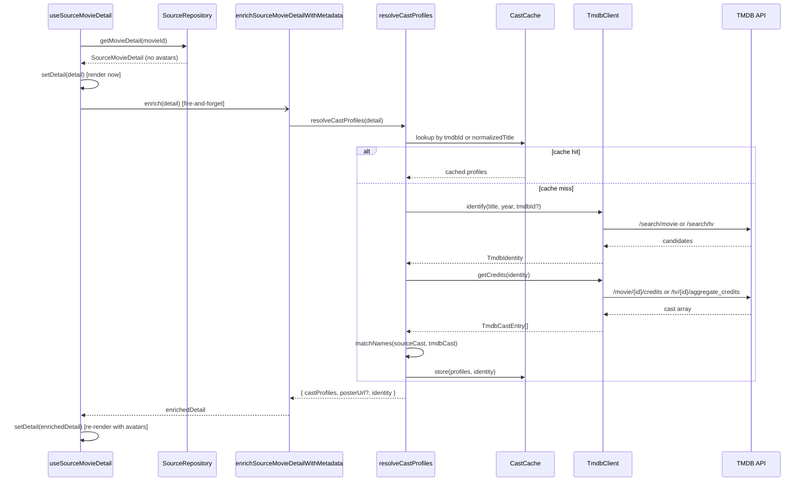

# Design Document

## Overview

This design introduces a centralized TMDB module at `modules/tmdb/` that resolves actor profile images (and, as a bonus, fallback posters) for any movie or show returned by any source plugin. The module mirrors the architecture and conventions of the existing `modules/poster/` module — orchestrator + per-API client + token-bucket rate limiter + in-memory cache + name/title normalization.

The module supersedes the ad-hoc `sources/tmdbMetadata.ts` implementation, which is currently:

- Limited to an allow-list of three plugins (`ophim`, `kkphim`, `nguonc`)
- Missing rate-limiting, request deduplication, and a structured timeout
- Mixing TMDB lookups with MissAV avatar scraping in one file

The new module is invoked from `hooks/useSourceMovieDetail.ts` after `SourceRepository.getMovieDetail()` returns. The enrichment runs asynchronously and updates state when complete, so the cast section in `app/movie/[id].tsx` re-renders with avatars without blocking the initial detail rendering. The `Detail_Adapter` (`sourceDetailToMovie()`) requires no changes — it already maps `castProfiles[name]` onto `cast[].avatar`.

### Key Design Decisions

| Decision | Rationale |
| --- | --- |
| Place under `modules/tmdb/`, not `sources/` | Matches `modules/poster/` precedent; keeps third-party API integrations grouped under `modules/`. |
| Reuse `TokenBucket` from `modules/poster/rateLimiter.ts` | Pure utility class; avoids duplication. Imported directly via `@/modules/poster/rateLimiter`. |
| Two-level cache (identity + credits) keyed by TMDB id | Allows reuse across different episode/season fetches that resolve to the same TMDB entity. |
| Universal application to all source plugins | Requirement 5.5; removes the existing source-id allow-list. Plugins that already provide `castProfiles` keep precedence (Requirement 5.3). |
| TMDB credentials via `EXPO_PUBLIC_TMDB_API_KEY` and `EXPO_PUBLIC_TMDB_BEARER_TOKEN` from `.env` | Expo's standard pattern; `.env` added to `.gitignore` to keep keys out of VCS. The existing `tmdbMetadata.ts` already follows this convention. |
| Bonus poster (Requirement 7) returned in the same payload as cast profiles | Single TMDB call powers both; consumer chooses whether to apply the poster. |

## Architecture

### High-Level Flow



### Module Layout

```
modules/tmdb/
├── index.ts                 # Public API surface
├── config.ts                # Credentials, timeouts, image sizes, source allow/block-list
├── cache.ts                 # In-memory CastCache (identity + credits + negative entries)
├── nameMatcher.ts           # Cast-name fuzzy matching (normalize, token, reversed-order)
├── titleNormalizer.ts       # Title normalization for cache keys (re-exports from poster)
├── resolveCastProfiles.ts   # Orchestrator: identify → credits → match → cache
├── enrichSourceMovieDetail.ts  # Glue: invoked by hooks; merges into SourceMovieDetail
└── clients/
    ├── types.ts             # TmdbApiClient interface, request/response shapes
    └── tmdbClient.ts        # Single API client (search, credits, aggregate_credits)
```

The existing `sources/tmdbMetadata.ts` is replaced by a thin re-export shim that delegates to `modules/tmdb/enrichSourceMovieDetail.ts`. The MissAV-specific avatar scraping currently mixed into that file is preserved by either:

1. Keeping it in `sources/tmdbMetadata.ts` after the TMDB enrichment, or
2. Moving it to a sibling `modules/missav/` later (out of scope for this spec).

This design takes option (1) to keep the change focused.

### Integration Point

The single integration point is in `hooks/useSourceMovieDetail.ts`:

```ts
// before (existing)
void enrichSourceMovieDetailWithMetadata(nextDetail).then(...)

// after (no change at the call site — module path stays the same via shim)
void enrichSourceMovieDetailWithMetadata(nextDetail).then(...)
```

`sources/adapters.ts` remains unchanged. The `cast[].avatar` field is already populated from `detail.castProfiles[name]`.

## Components and Interfaces

### `resolveCastProfiles` (orchestrator)

```ts
export interface ResolveCastParams {
  /** Source movie detail used to determine identity + cast list to match. */
  detail: Pick<
    SourceMovieDetail,
    | "sourceId"
    | "title"
    | "originName"
    | "year"
    | "casts"
    | "castProfiles"
    | "tmdbId"
    | "tmdbType"
    | "tmdbSeason"
    | "posterUrl"
  >;
}

export interface ResolveCastResult {
  /** Map of source-cast-name → TMDB profile image URL. Empty on miss. */
  castProfiles: Record<string, string>;
  /** TMDB poster URL (w500), present when an identity was resolved. */
  posterUrl?: string;
  /** TMDB identity used; absent when no match found. */
  identity?: TmdbIdentity;
}

export function resolveCastProfiles(params: ResolveCastParams): Promise<ResolveCastResult>;
```

Behavior:

1. Parse `detail.casts` (comma-separated, supports `[name](slug)` linked form) → `ParsedCastEntry[]`.
2. Resolve `TmdbIdentity` (skip search when `tmdbId` is provided per Requirement 1.1).
3. Cache lookup keyed by identity, then by normalized-title fallback.
4. On miss, fetch credits / aggregate_credits and run `matchNames`.
5. Cache the result (positive or negative) and return.
6. All errors caught internally; method never throws.

### `enrichSourceMovieDetailWithMetadata` (entry point)

```ts
export function enrichSourceMovieDetailWithMetadata(
  detail: SourceMovieDetail,
): Promise<SourceMovieDetail>;
```

- Calls `resolveCastProfiles({ detail })`.
- Merges the result into `detail.castProfiles` while preserving plugin-provided entries (Requirement 5.3 — plugin entries win).
- Optionally swaps `posterUrl` if the source poster is missing or matches a known placeholder pattern (Requirement 7.4); never overwrites a valid plugin poster (Requirement 7.3).
- Returns the enriched detail. On any internal failure, returns the original `detail` unchanged.

### `TmdbClient`

```ts
export interface TmdbClient {
  /** Identify a TMDB entry from explicit ids or by title+year search. */
  identify(input: IdentifyInput): Promise<TmdbIdentity | null>;

  /** Standard /movie|/tv/{id}/credits endpoint. */
  getCredits(identity: TmdbIdentity): Promise<TmdbCreditsResponse | null>;

  /** /tv/{id}/aggregate_credits endpoint, used for TV with a season. */
  getAggregateCredits(identity: TmdbIdentity): Promise<TmdbCreditsResponse | null>;
}

export interface IdentifyInput {
  tmdbId?: string;
  tmdbType?: string;
  tmdbSeason?: number;
  title: string;
  originalTitle?: string;
  year?: number;
}
```

Implementation notes:

- One client class talks to TMDB. Unlike the poster module's three-client waterfall, TMDB is a single source of truth here.
- All requests go through the shared `TokenBucket` (40 req / 10 s).
- Each request uses `AbortController` with the configured timeout (default 5000 ms).
- 429 responses trigger `tokenBucket.backoff()`.
- Credentials read lazily from `getConfig()` so tests can mutate them.

### `nameMatcher`

```ts
export function normalizeName(value: string): string;

export interface NameMatchInput {
  sourceName: string;
  tmdbCast: TmdbCastEntry[];
}

/** Returns the index of the matched TMDB cast entry, or -1. */
export function findMatch(input: NameMatchInput): number;
```

Matching strategy (in order, first hit wins):

1. **Exact normalized match** — `normalizeName(source) === normalizeName(tmdb.name | tmdb.original_name)`.
2. **Token-subset match** — every token of the shorter normalized name appears in the longer one's token set.
3. **Reversed-order match** — `tokens(source).reverse().join(" ") === normalizeName(tmdb)`.

`normalizeName` differs from `normalizeTitle` (poster module): it strips diacritics, lowercases, and replaces non-alphanumeric runs with single spaces, then collapses whitespace.

### `CastCache`

```ts
export interface CastCacheEntry {
  identity?: TmdbIdentity;
  castProfiles: Record<string, string>;
  posterUrl?: string;
  isNegative: boolean;
  timestamp: number;
}

export class CastCache {
  /** Lookup by tmdbId first, then by normalizedTitle. */
  get(key: { tmdbId?: string; title?: string }): CastCacheEntry | undefined;
  set(key: { tmdbId?: string; title?: string }, entry: CastCacheEntry): void;
  has(key: { tmdbId?: string; title?: string }): boolean;
}
```

In-memory `Map`-backed; no expiration; persists for the app session (Requirement 4.4). Both successful and empty-result lookups are cached (Requirement 4.3).

### Concurrency / Deduplication

```ts
const pendingRequests = new Map<string, Promise<ResolveCastResult>>();
```

Keyed by `tmdbId ?? normalizedTitle`. Identical to the poster module's pendingRequests pattern. Concurrent calls for the same identity share one in-flight promise (Requirement 4.5).

### Configuration

```ts
export interface TmdbModuleConfig {
  /** Optional API key (v3) — overrides bearer when both present. */
  apiKey?: string;
  /** Optional bearer token (v4 read access). */
  bearerToken?: string;
  /** Per-request timeout in ms (default 5000). */
  timeoutMs: number;
  /** Image size segment for poster URLs (default "w500"). */
  posterSize: string;
  /** Image size segment for profile URLs (default "w185"). */
  profileSize: string;
  /** Max cast entries returned (default 20). */
  maxCastEntries: number;
  /** Source ids that should be skipped (e.g. adult sources). Empty by default. */
  excludedSourceIds: string[];
  /** Language code passed to TMDB (default "vi-VN"). */
  language: string;
}

export function configureTmdbModule(config: Partial<TmdbModuleConfig>): void;
export function getConfig(): TmdbModuleConfig;
export function isTmdbEnabled(): boolean; // false when no api key and no bearer token
```

Credentials default to:

```ts
apiKey: process.env.EXPO_PUBLIC_TMDB_API_KEY,
bearerToken: process.env.EXPO_PUBLIC_TMDB_BEARER_TOKEN,
```

A `.env` file (added to `.gitignore`) holds the actual values. The Expo `EXPO_PUBLIC_` convention exposes them to the client at build time without committing them.

### Rate Limiting

The shared `TokenBucket` is configured for TMDB:

```ts
new TokenBucket({
  maxTokens: 40,
  refillRate: 4,        // 40 tokens / 10 seconds
  backoffMs: 10_000,
});
```

A single bucket is shared across all `TmdbClient` requests so identity, credits, and aggregate-credits calls all draw from the same budget.

## Data Models

### Internal types

```ts
export interface TmdbIdentity {
  tmdbId: string;
  tmdbType: "movie" | "tv";
  tmdbSeason?: number;
}

export interface TmdbCastEntry {
  name?: string;
  original_name?: string;
  profile_path?: string | null;
  order?: number;
  /** Present on aggregate_credits responses; ignored otherwise. */
  total_episode_count?: number;
}

export interface TmdbCreditsResponse {
  cast?: TmdbCastEntry[];
}

export interface TmdbSearchResult {
  id: number;
  media_type?: "movie" | "tv";
  title?: string;
  name?: string;
  original_title?: string;
  original_name?: string;
  release_date?: string;
  first_air_date?: string;
  poster_path?: string | null;
  popularity?: number;
}

export interface ParsedCastEntry {
  name: string;
  /** Optional source-specific slug, used by sibling enrichers like MissAV. */
  slug?: string;
}
```

### Existing types referenced (no changes)

- `SourceMovieDetail` (`sources/types.ts`) — already has `castProfiles?: Record<string, string>`, `tmdbId?`, `tmdbType?`, `tmdbSeason?`.
- `Movie.cast: CastMember[]` (`types/movie.ts`) — `avatar?: string` already populated by adapter.

### Identity Scoring

Adapted from the existing `scoreTmdbCandidate`:

| Signal | Weight |
| --- | --- |
| Normalized title exact match | +120 |
| Normalized title substring (either direction) | +80 |
| Year delta = 0 | +30 |
| Year delta = 1 | +12 |
| Year delta ≤ 2 | +4 |
| Popularity (capped at 25) | +0…+25 |

Highest score wins across both `/search/movie` and `/search/tv` results. Ties broken by `media_type === "movie"` first, then by `popularity`.

<!-- Correctness Properties section is added below after prework. -->


## Correctness Properties

*A property is a characteristic or behavior that should hold true across all valid executions of a system — essentially, a formal statement about what the system should do. Properties serve as the bridge between human-readable specifications and machine-verifiable correctness guarantees.*

### Property 1: Provided ids skip search

*For any* `SourceMovieDetail` with a non-empty `tmdbId` and `tmdbType`, `resolveCastProfiles` SHALL invoke the credits endpoint for that exact `(tmdbId, tmdbType)` and SHALL NOT invoke the search endpoints.

**Validates: Requirements 1.1**

### Property 2: Title-and-year fallback search

*For any* `SourceMovieDetail` without `tmdbId`, when credentials are configured, `resolveCastProfiles` SHALL invoke the TMDB search endpoints with the detail's title (or `originName`) and `year` parameters.

**Validates: Requirements 1.2**

### Property 3: Highest-scoring candidate wins

*For any* set of `/search/movie` and `/search/tv` candidates returned by TMDB, the chosen `TmdbIdentity` SHALL correspond to the candidate whose `scoreTmdbCandidate` value is greater than or equal to every other candidate's score.

**Validates: Requirements 1.3**

### Property 4: No-match and API errors yield empty result without throwing

*For any* invocation where TMDB returns no candidates, returns an error response, throws, or times out, `resolveCastProfiles` SHALL return a result with an empty `castProfiles` map and SHALL NOT propagate any exception to the caller.

**Validates: Requirements 1.4, 1.5**

### Property 5: Profile URL shape and null filtering

*For any* TMDB credits response, every entry in the resulting `castProfiles` SHALL have a value that begins with `${TMDB_IMAGE_BASE}${profileSize}` (i.e., `https://image.tmdb.org/t/p/w185`) and SHALL correspond to a TMDB cast entry whose `profile_path` is non-null; cast entries with null `profile_path` SHALL produce no entry in the map.

**Validates: Requirements 2.1, 2.2, 2.3**

### Property 6: Top-20 billed cast are considered

*For any* TMDB credits response with at least 20 entries ordered by billing (`order` ascending), the matching procedure SHALL consider at least the first 20 cast entries as potential matches for the source cast list.

**Validates: Requirements 2.4**

### Property 7: TV with season uses aggregate credits

*For any* `TmdbIdentity`, the credits endpoint selected SHALL be `aggregate_credits` if and only if `tmdbType === "tv"` and `tmdbSeason` is defined; otherwise the standard `credits` endpoint SHALL be used.

**Validates: Requirements 2.5**

### Property 8: Name match invariance under recasing and diacritics

*For any* source name S and TMDB cast list C, applying arbitrary letter-case changes and arbitrary insertion of Unicode combining diacritics to S or to entries of C SHALL NOT change which TMDB entry (if any) is matched.

**Validates: Requirements 3.1, 3.2**

### Property 9: Token-subset matching for shorter name

*For any* multi-token names L and S where the normalized token multiset of S is a subset of the normalized token multiset of L, `findMatch` between S and a list containing L SHALL return the index of L.

**Validates: Requirements 3.3**

### Property 10: Reversed-token-order matching

*For any* multi-token name N, `findMatch` between N and a list containing the reversed-token form of N SHALL return that entry's index.

**Validates: Requirements 3.4**

### Property 11: Disjoint source names produce no profile entries

*For any* source cast list and TMDB cast list whose normalized name sets are disjoint, the resulting `castProfiles` SHALL contain no key from the source cast list.

**Validates: Requirements 3.5**

### Property 12: Cache hit dispatches no further client calls

*For any* sequence of `resolveCastProfiles` invocations whose first call resolves to a positive result, every subsequent invocation with a key that hits the cache (same `tmdbId`, or same normalized title when `tmdbId` is absent) SHALL NOT trigger any additional `TmdbClient` requests and SHALL return a result equal to the cached result.

**Validates: Requirements 4.1, 4.2**

### Property 13: Negative cache prevents repeated failed lookups

*For any* invocation that produces a negative result (no identity found, or empty cast), repeated invocations with the same key (within the same session) SHALL NOT trigger additional `TmdbClient` requests.

**Validates: Requirements 4.3**

### Property 14: Cache entries do not expire within the session

*For any* cache entry stored at time T0 and any time T1 ≥ T0, `cache.get(key)` at T1 SHALL still return that entry (i.e., there is no TTL).

**Validates: Requirements 4.4**

### Property 15: Concurrent resolves share an in-flight promise

*For any* N ≥ 2 concurrent calls to `resolveCastProfiles` with the same key while the first call is still pending, the underlying `TmdbClient.identify` and credits methods SHALL each be invoked at most once across all N calls, and all N callers SHALL receive equal results.

**Validates: Requirements 4.5**

### Property 16: Merge preserves plugin-provided entries

*For any* `existing: Record<string, string>` already on `detail.castProfiles` and any `resolved: Record<string, string>` returned by the TMDB resolver, the merged map M SHALL satisfy: for every key k in `existing`, `M[k] === existing[k]`; and for every key k in `resolved` that is not in `existing`, `M[k] === resolved[k]`.

**Validates: Requirements 5.2, 5.3**

### Property 17: Resolver behavior is invariant to `sourceId`

*For any* two `SourceMovieDetail` values that are equal except for `sourceId` (and where neither sourceId is in `excludedSourceIds`), `resolveCastProfiles` SHALL produce equal results and emit the same sequence of `TmdbClient` calls.

**Validates: Requirements 5.5**

### Property 18: Token bucket caps TMDB requests

*For any* sequence of TMDB requests issued through the configured `TokenBucket`, the number of `fetch` invocations dispatched in any rolling 10-second window SHALL NOT exceed `maxTokens` (40).

**Validates: Requirements 6.1**

### Property 19: 429 backoff and retry without drop

*For any* request that receives an HTTP 429 response followed by a 200 response after the configured `backoffMs`, the orchestrator SHALL eventually return the successful payload to the caller without dropping the request.

**Validates: Requirements 6.2**

### Property 20: Disabled module makes no fetches

*For any* invocation while `isTmdbEnabled() === false` (no API key and no bearer token), `resolveCastProfiles` SHALL return an empty `castProfiles` map and SHALL NOT call `fetch`.

**Validates: Requirements 6.4**

### Property 21: Per-request timeout yields empty result

*For any* TMDB request whose response does not arrive within `timeoutMs`, the request SHALL be aborted and the orchestrator SHALL return an empty `castProfiles` map without throwing.

**Validates: Requirements 6.5**

### Property 22: Poster URL is set when identity carries poster_path

*For any* successful identity whose source TMDB record has a non-null `poster_path`, the `ResolveCastResult.posterUrl` SHALL be defined and SHALL begin with `${TMDB_IMAGE_BASE}${posterSize}` (i.e., `https://image.tmdb.org/t/p/w500`).

**Validates: Requirements 7.1, 7.2**

### Property 23: Existing non-placeholder poster is preserved

*For any* `SourceMovieDetail` whose `posterUrl` is non-empty and does not match the known placeholder pattern, `enrichSourceMovieDetailWithMetadata` SHALL leave `detail.posterUrl` unchanged.

**Validates: Requirements 7.3**

### Property 24: Empty or placeholder poster is filled when TMDB has one

*For any* `SourceMovieDetail` whose `posterUrl` is empty or matches the placeholder pattern, when an identity is resolved with a non-null `poster_path`, `enrichSourceMovieDetailWithMetadata` SHALL set `detail.posterUrl` to the TMDB poster URL.

**Validates: Requirements 7.4**

## Error Handling

The TMDB module is non-critical: every failure mode falls back to "no avatars available" and never blocks rendering. Error categories and their handling:

| Failure | Handling |
| --- | --- |
| Missing API key + bearer token | `isTmdbEnabled()` returns `false`. `resolveCastProfiles` short-circuits to an empty result. Logged once per session via `console.warn`. |
| Network error (DNS, offline, fetch reject) | Caught inside `TmdbClient`. Method returns `null`. Orchestrator returns empty result. Logged via `console.warn` with sanitized URL (no api key). |
| HTTP 4xx other than 429 (e.g., 401 invalid key, 404 not found) | Treated as no result. For 401, the module sets an internal `disabledForSession` flag so no further requests are issued until reconfigured. |
| HTTP 429 rate-limited | `TokenBucket.backoff()` invoked. The pending request is retried after `backoffMs`. |
| Per-request timeout (`AbortController`) | The promise is wrapped in `Promise.race` against `timeoutMs`. On timeout, the client returns `null`. The orchestrator caches a negative entry to avoid repeated retries during the same session. |
| Malformed JSON response | Caught at `response.json()`. Returns `null`. |
| TMDB returns zero candidates | Negative cache entry, empty result. |
| TMDB returns candidates but no `cast` field | Negative cache entry, empty result. |
| Source cast string is empty | Skip TMDB call entirely; return empty result. |
| Detail's `tmdbId` is set but `tmdbType` is missing | Default `tmdbType` to `"movie"`; if `aggregate_credits` is needed but unavailable, fall back to `/credits`. |
| Source detail mutated concurrently | Hook compares `currentDetail.id === enrichedDetail.id` before applying state update; mismatched updates are dropped. |

The module never throws to its caller. All warnings go through `console.warn` with the prefix `[tmdb]` for filterability.

## Testing Strategy

The TMDB module is a good fit for property-based testing: it is largely a pure transformation of inputs (titles, years, cast names, identities) to outputs (cast profile maps, poster URLs), with mockable I/O. PBT applies. We also rely on example-based tests for wiring/UI concerns.

### Tooling

- **Test runner**: Vitest (already configured in `package.json`).
- **Property-based testing**: `fast-check` (already a dev dependency).
- **Mocks**: `vi.fn()`/`vi.spyOn()` for `fetch` and the `TmdbClient` interface; `vi.useFakeTimers()` for time-dependent properties (cache, timeout, backoff).

### Unit Tests (examples)

Located alongside source files (`*.test.ts`):

- `modules/tmdb/config.test.ts`: example tests for `configureTmdbModule`, `getConfig`, `isTmdbEnabled`. Covers default values and credential precedence (apiKey overrides bearerToken when both present).
- `modules/tmdb/cache.test.ts`: example tests for `get/set/has` lookup by `tmdbId` and by normalized title fallback; positive vs negative entry storage.
- `modules/tmdb/clients/tmdbClient.test.ts`: example tests for endpoint URL construction (movie credits, tv credits, tv aggregate_credits), 429 → backoff, 401 → disable-for-session, request abort on timeout.
- `modules/tmdb/enrichSourceMovieDetail.test.ts`: example tests for the merge/poster-fallback wiring; covers Property 16, 23, 24 with concrete fixtures.
- `hooks/useSourceMovieDetail.enrich.test.ts`: example test for the hook integration (Examples E1 and E2 from prework — wiring and timing of asynchronous enrichment).

### Property-Based Tests

Located at `modules/tmdb/properties.test.ts`. Each test uses `fc.assert` with a minimum of 100 iterations (`numRuns: 100`). Each test is tagged with a comment matching the design property.

```ts
// Feature: tmdb-cast-images, Property 5: Profile URL shape and null filtering
it("profile URLs have correct prefix and null profile_paths are filtered", () => {
  fc.assert(
    fc.property(arbTmdbCastList(), arbSourceCastList(), (tmdbCast, sourceCast) => {
      const profiles = buildCastProfiles(parseCast(sourceCast), tmdbCast);
      for (const url of Object.values(profiles)) {
        expect(url.startsWith("https://image.tmdb.org/t/p/w185")).toBe(true);
      }
      // Implicit: entries with null profile_path produce no map entry.
    }),
    { numRuns: 100 },
  );
});
```

Each design property maps to one PBT test:

| Property | Test target | Notes |
| --- | --- | --- |
| P1 — Provided ids skip search | `resolveCastProfiles` with mocked `TmdbClient` | assert `identify` not called. |
| P2 — Title+year fallback search | `resolveCastProfiles` with mocked client | assert search params include title and year. |
| P3 — Highest-scoring candidate | `pickBestCandidate` (pure) | generate candidate sets, assert chosen has max score. |
| P4 — No-match / errors → empty | `resolveCastProfiles` with failing mocks | assert no throw and empty map. |
| P5 — Profile URL shape + null filter | `buildCastProfiles` (pure) | assert prefix and null filter. |
| P6 — Top-20 billed considered | `buildCastProfiles` with >20 entries | assert at least top 20 considered. |
| P7 — TV+season uses aggregate_credits | `resolveCastProfiles` with mocked client | assert correct endpoint dispatched. |
| P8 — Recase/diacritic invariance | `findMatch` (pure) | use `arbCaseVariants` and `arbDiacriticInjections`. |
| P9 — Token-subset matching | `findMatch` (pure) | derive shorter from longer. |
| P10 — Reversed-order matching | `findMatch` (pure) | reverse tokens on one side. |
| P11 — Disjoint names → no entries | `buildCastProfiles` (pure) | use disjoint name generator. |
| P12 — Cache hit no client calls | `resolveCastProfiles` + cache | assert `mock.calls.length === 1` after second call. |
| P13 — Negative cache | `resolveCastProfiles` + cache | mock returns null; assert one call. |
| P14 — No expiration | `CastCache` with fake timers | advance arbitrary durations. |
| P15 — Concurrent dedupe | `resolveCastProfiles` | spawn N concurrent. |
| P16 — Merge preserves plugin entries | `mergeCastProfiles` (pure) | generate maps, check invariants. |
| P17 — sourceId invariance | `resolveCastProfiles` | vary sourceId only. |
| P18 — TokenBucket cap | `TmdbClient` + bucket | use fake timers and counter. |
| P19 — 429 backoff retry | `TmdbClient` + mocked fetch | mock 429-then-200 sequence. |
| P20 — Disabled module no fetch | `resolveCastProfiles` | clear creds; spy on fetch. |
| P21 — Timeout yields empty | `TmdbClient` with hung fetch | advance fake timer. |
| P22 — Poster URL set | `resolveCastProfiles` | assert `posterUrl` prefix. |
| P23 — Non-placeholder preserved | `enrichSourceMovieDetailWithMetadata` | random non-placeholder URL stays. |
| P24 — Placeholder filled | `enrichSourceMovieDetailWithMetadata` | empty/placeholder gets TMDB URL. |

### Generators (`fast-check` arbitraries)

```ts
const arbName = fc.string({ minLength: 1, maxLength: 30, unit: "grapheme" });
const arbTmdbCastEntry = fc.record({
  name: arbName,
  original_name: fc.option(arbName, { freq: 4 }),
  profile_path: fc.option(fc.string().map(s => `/${s}.jpg`), { freq: 2 }),
  order: fc.integer({ min: 0, max: 100 }),
});
const arbSourceCastList = fc.array(arbName, { maxLength: 30 })
  .map(names => names.join(", "));
const arbDetail = fc.record({
  sourceId: fc.constantFrom("ophim", "kkphim", "nguonc", "phimpal", "animevietsub"),
  title: arbName,
  // ... other SourceMovieDetail fields
});
```

### Smoke / Configuration Tests (S1)

- A single test asserts `.gitignore` contains an entry that excludes `.env` and `.env.*` from version control.
- A single CI lint step (or pre-commit hook) verifies no committed file in the repo contains a TMDB v3 API key pattern (`[a-f0-9]{32}`) outside of test fixtures.

### What is NOT property-tested

- The hook integration in `useSourceMovieDetail.ts` (Examples E1, E2): tested as example-based unit tests with React Testing Library because the behavior is concrete wiring, not universal across inputs.
- The `ResolveCastResult` shape (Example E3): a single TypeScript-level assertion suffices.
- The TMDB API itself (rate-limiting headers, body shapes, etc.): we mock the network. Real-API behavior is the responsibility of TMDB and is monitored by example-based smoke tests in CI if and when desired.
- Visual rendering of `CastList` with new avatars: existing component test stays as-is; no new visual tests for this feature.
